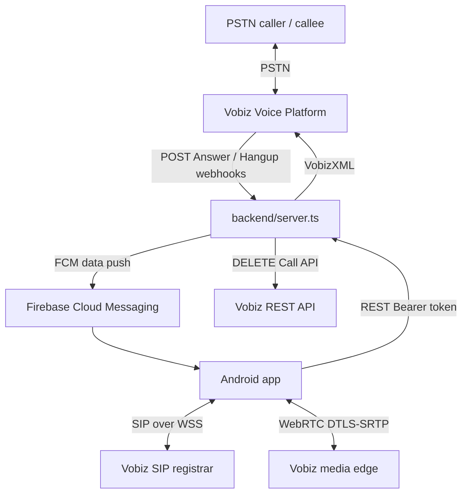
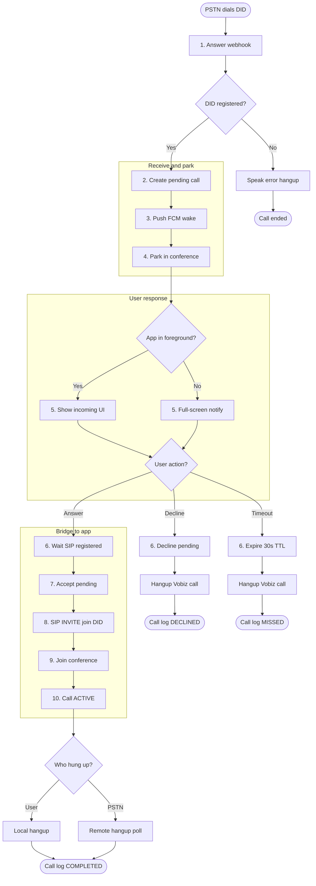
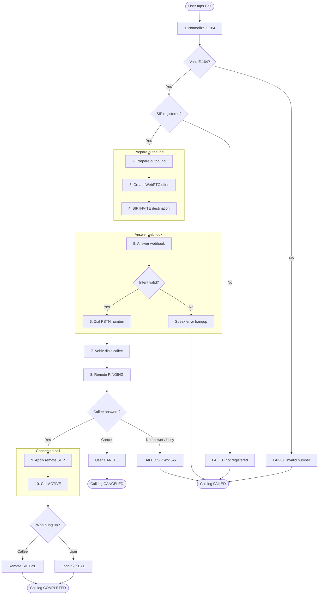

# VobizVoip Call Workflows

Status: As implemented  
Date: 24 August 2026  
Source: `backend/src/server.ts`, `CallCoordinator.kt`, `SipClient.kt`

These are the **actual inbound and outbound paths** in this repo. There is no IVR, queue, voicemail, or transfer. Twilio appears only as a STUN server.

---

## Architecture

| Layer | Path | Role |
|---|---|---|
| Orchestration | `app/.../domain/CallCoordinator.kt` | Call state machine, inbound/outbound logic |
| SIP signaling | `app/.../signaling/SipClient.kt` | WSS, REGISTER, INVITE, ACK, BYE, CANCEL |
| Media | `app/.../media/WebRtcAudioSession.kt` | SDP offer/answer, ICE, audio |
| Backend API (app) | `app/.../data/BackendApi.kt` | `/calls/outbound`, `/calls/:id/accept`, etc. |
| Backend server | `backend/src/server.ts` | Webhooks, pending-call state, FCM |
| Push wake-up | `app/.../push/VobizMessagingService.kt` | Inbound FCM handler |

### App call phases (`CallPhase`)

`IDLE` → `OUTGOING` → `RINGING` → `INCOMING` → `CONNECTING` → `ACTIVE` → `ENDING` → `FAILED`

### Call log results (`CallResult`)

`COMPLETED` · `MISSED` · `DECLINED` · `CANCELED` · `FAILED`

---

## 1. Inbound call workflow

Primary path: **PSTN → conference park → FCM wake → app joins conference**.

The backend always parks the PSTN caller in a Vobiz conference and pushes FCM. It does **not** return `<Dial><User>sip:…</User>` in the current implementation.

### Labeled inbound processes

| # | Process | What happens |
|---|---|---|
| 1 | **Answer webhook** | Vobiz POSTs `POST /webhooks/vobiz/:token/answer`. `From` is not a registered SIP endpoint, so this is treated as inbound PSTN. |
| 2 | **Create pending call** | Backend stores a 30s pending record (`createPendingCall()`) and tracks the inbound leg UUID. |
| 3 | **Push FCM wake** | High-priority `type=inbound_call` data message (`pendingCallId`, caller, expiry). |
| 4 | **Park in conference** | VobizXML parks the caller in a conference (`conferenceParkXml()`). Optional wait audio via `CONFERENCE_WAIT_SOUND`. |
| 5 | **Show incoming UI / notify** | Foreground → in-app incoming screen. Background → full-screen Answer/Decline notification. |
| 6 | **User action** | **Answer** waits for SIP `REGISTERED` (up to 20s). **Decline** hangs up the Vobiz call → `DECLINED`. **30s timeout** hangs up → `MISSED`. |
| 7 | **Accept pending** | App `POST /calls/:id/accept`. Backend returns `{ joinNumber: did }`. |
| 8 | **SIP INVITE join DID** | App places a SIP INVITE to that DID via `startOutgoing(joinNumber, prepareBackend=false)`. |
| 9 | **Join conference** | Answer webhook sees the SIP-originated leg and a pending join, returns `<Conference endConferenceOnExit=true>`. |
| 10 | **Call ACTIVE** | Legs are bridged. App polls inbound status every 1s (`startInboundStatusPolling()`). Hangup → `COMPLETED`. |

### Inbound entry points

| Entry | File | Function / route |
|---|---|---|
| PSTN dials Vobiz DID | Vobiz platform | Triggers Voice App Answer URL |
| Vobiz Answer webhook | `backend/src/server.ts` | `POST /webhooks/vobiz/:token/answer` |
| FCM push | `VobizMessagingService` | `onMessageReceived` (`type=inbound_call`) |
| Notification / activity intents | `MainActivity.handleIntent` | `ACTION_SHOW_PENDING`, `ACTION_ANSWER_PENDING`, `ACTION_DECLINE_PENDING` |
| In-app Answer / Decline | `RootScreen` → `CallCoordinator` | `acceptPendingInbound`, `declinePendingInbound` |

### Inbound termination

| Scenario | Trigger | Call log |
|---|---|---|
| Answered and connected | Either party hangs up after `ACTIVE` | `COMPLETED` |
| Declined (FCM path) | Decline button or notification | `DECLINED` |
| Missed (30s pending expiry) | Backend timeout → `hangupVobizCall()` | `MISSED` |
| Remote hung up (PSTN leg) | Hangup webhook; poll sees `active=false` | `MISSED` or `COMPLETED` |
| SIP not registered on answer | Registration failed during accept | `FAILED` |
| Busy (second call while active) | New INVITE while not `IDLE` | Rejected 486 at SIP layer |

### Alternate inbound path: direct SIP INVITE

Used when Vobiz sends a SIP `INVITE` directly to the registered WSS endpoint. The shipped backend does **not** use this for PSTN.

| # | Process | Component |
|---|---|---|
| 1 | SIP INVITE arrives on WSS | `SipClient.handleIncomingInvite()` |
| 2 | Already in a call? → reject 486 Busy | `SipClient` / `CallCoordinator` |
| 3 | Valid SDP? → reject 488 if missing | `SipClient` |
| 4 | Respond 100 Trying, 180 Ringing | `SipClient` |
| 5 | Phase `INCOMING`, play ringtone | `CallCoordinator` |
| 6 | User answers → WebRTC answer + SIP 200 OK | `acceptIncoming()` |
| 7 | Mark `ACTIVE` | `markCallActive()` |

---

## 2. Outbound call workflow

Path: **app prepares destination → SIP INVITE → Answer webhook returns `<Dial>` → Vobiz dials PSTN**.

### Labeled outbound processes

| # | Process | What happens |
|---|---|---|
| 1 | **Normalize E.164** | Dialer / recents / `tel:` intent → `PhoneNumberNormalizer`. Must match `+[1-9]` plus 7–14 digits. |
| 2 | **Prepare outbound** | `POST /calls/outbound` stores destination, caller ID, and record flag (30s TTL). SIP must already be `REGISTERED`. |
| 3 | **Create WebRTC offer** | `WebRtcAudioSession.createOffer()` builds local SDP. |
| 4 | **SIP INVITE destination** | `SipClient.invite()` over WSS to the Vobiz registrar. |
| 5 | **Answer webhook** | Vobiz POSTs the SIP-originated leg. No pending conference join → outbound branch. |
| 6 | **Dial PSTN number** | VobizXML: optional `<Record>` + `<Dial timeout="30"><Number>` + `<Hangup/>`. Missing destination/caller ID, or destination == caller ID → speak error and hang up. |
| 7 | **Vobiz dials callee** | Platform places the PSTN call (30s timeout). |
| 8 | **Remote RINGING** | SIP 180/183 → phase `RINGING`. User hangup here sends SIP `CANCEL` → `CANCELED`. |
| 9 | **Apply remote SDP** | Callee answers → SIP 200 + SDP → ACK → `webRtc.applyAnswer()`. |
| 10 | **Call ACTIVE** | Two-way audio. Local hangup = SIP `BYE`. Remote hangup = `CallEnded`. After connect → `COMPLETED`. SIP 4xx/5xx → `FAILED`. |

### Outbound entry points

| Entry | File | Function |
|---|---|---|
| Keypad Call button | `DialerScreen.kt` | `onCall` → `RootScreen.onPlaceCall` |
| Home recents / contacts | `HomeScreen.kt`, `ContactsScreen.kt` | `onCall` |
| External `tel:` / `ACTION_CALL` | `MainActivity.handleIntent` | `requestDial(autoCall=true)` → `placeCall` |
| External dial-only intent | `MainActivity` | `ACTION_DIAL` → prefill keypad |

### Outbound termination

| Scenario | Trigger | Call log |
|---|---|---|
| Connected and ended normally | User hangup after `ACTIVE` | `COMPLETED` |
| Canceled before answer | User hangup in `OUTGOING` / `RINGING` → SIP `CANCEL` | `CANCELED` |
| Remote BYE | Callee hangs up | `COMPLETED` if connected, else `CANCELED` |
| No answer / busy / unreachable | SIP 4xx/5xx on INVITE | `FAILED` |
| SIP auth failure | 401/407 on INVITE (one retry) | `FAILED` |
| ICE failure | No routable candidates | `FAILED` |
| Backend prepare failed | `prepareOutbound` HTTP error | `FAILED` |
| Outbound intent expired | SIP INVITE more than 30s after prepare | Speak + hangup at Vobiz |

SIP failure mapping (`SipClient.reasonFor`):

| Code | Reason |
|---|---|
| 401, 403, 407 | SIP authentication was rejected |
| 404 | Destination was not found |
| 408 | Call timed out |
| 480 | Destination is unavailable |
| 486 | Destination is busy |

---

## Shared teardown

Both directions share this end-of-call work:

1. Hangup webhook (`POST /webhooks/vobiz/:token/hangup`) clears pending and inbound-active state.
2. If recording is enabled, VobizXML includes `<Record recordSession="true">`. Vobiz POSTs the MP3 to `/webhooks/.../record`.
3. App writes a call log (`CallCoordinator.recordCall()`).
4. App refreshes recordings after ~8s if the result was `COMPLETED`.

---

## Webhook and API map

| URL | Method | Purpose |
|---|---|---|
| `/webhooks/vobiz/:token/answer` | POST | Main routing decision: inbound park, outbound dial, or conference join |
| `/webhooks/vobiz/:token/hangup` | POST | End-of-call cleanup |
| `/webhooks/vobiz/:token/dial-events` | POST | Outbound dial lifecycle (log only) |
| `/webhooks/vobiz/:token/dial-result` | POST | Outbound dial result (log only) |
| `/webhooks/vobiz/:token/record` | POST | Recording URL delivery |
| `/webhooks/vobiz/:token/conference-events` | POST | Conference member leave (log only) |
| `/calls/outbound` | POST | Pre-register outbound intent |
| `/calls/inbound-status` | GET | Poll PSTN leg active state |
| `/calls/:id/accept` | POST | Accept pending inbound → return `joinNumber` |
| `/calls/:id/decline` | POST | Decline + terminate Vobiz call |
| `/devices/register` | POST | FCM installation + caller ID mapping |
