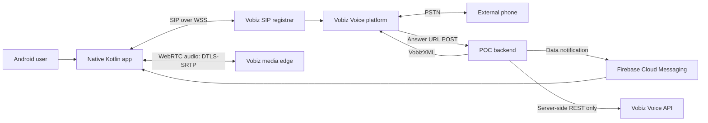
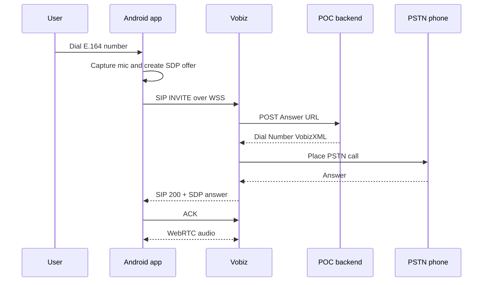

# Vobiz Native Android Calling POC — Design Document

Status: Approved for POC implementation  
Date: 21 August 2026  
Target: Native Android application written in Kotlin  
Scope: Inbound and outbound PSTN voice calls through Vobiz

Approved decisions:

- fully native Kotlin implementation;
- application ID `com.enetro.vobizvoip`;
- minimum Android version: Android 12 / API 31;
- inbound calling in foreground, background, and terminated-app states;
- local Node.js/TypeScript backend exposed through a secure tunnel;
- dedicated Firebase POC project;
- physical Android 12+ test device; separate PSTN test phone still to be confirmed.

## 1. Executive summary

The POC will be a native Kotlin Android softphone that:

- registers a Vobiz SIP endpoint over secure WebSocket;
- uses WebRTC for microphone and remote audio;
- places outbound calls from the app to PSTN numbers;
- receives inbound calls made to an attached Vobiz number;
- supports answer, reject, hang up, mute, speaker routing, and DTMF;
- uses Firebase Cloud Messaging (FCM) to alert or wake the app for inbound calls;
- delegates Vobiz call-control XML, account API calls, and secrets to a small backend.

Important finding: the official repository named
[Vobiz-Android-Sample](https://github.com/vobiz-ai/Vobiz-Android-Sample) is a Flutter/Dart
implementation, not a native Kotlin SDK. It supports Android and iOS through
`flutter_webrtc`. Vobiz also provides a Java REST SDK, but that SDK controls the Vobiz
Voice API and does not provide an Android WebRTC media or SIP client.

For a native Kotlin application, the SIP/WebRTC client must therefore be ported from the
documented Flutter reference flow or supplied by Vobiz as a private/native SDK. This design
uses a native Kotlin port and keeps the POC deliberately narrow.

## 2. Goals

### 2.1 POC goals

1. Register one Android device as one Vobiz SIP endpoint.
2. Place an audio call from Android to an E.164 PSTN number.
3. Receive and answer an inbound call to one Vobiz number.
4. Handle foreground, background, and terminated-app inbound notifications.
5. Show deterministic call states: disconnected, registering, ready, outgoing, ringing,
   connecting, active, ending, and failed.
6. Verify two-way audio on a physical Android device and at least two network types.
7. Prevent Vobiz account credentials and Firebase server credentials from entering the APK.

### 2.2 Non-goals

- iOS implementation;
- video calling;
- AI voice-agent functionality;
- call recording, transcription, transfer, hold, merge, or conferencing as user-facing features;
- multi-line or multi-call support;
- production-grade tenant/user administration;
- Play Store release;
- a production SLA or a full TURN deployment.

Conference bridging may be used internally for reliable background inbound calling, but a
conference UI is outside this POC.

## 3. Findings from Vobiz references

The design is based on the official
[Vobiz GitHub organization](https://github.com/vobiz-ai), the
[Vobiz Android sample](https://github.com/vobiz-ai/Vobiz-Android-Sample), and the
[Vobiz WebRTC documentation](https://vobiz.ai/docs/blogs/what-is-webrtc).

Verified reference behavior:

- SIP registration uses `wss://registrar.vobiz.ai:5063/` with WebSocket subprotocol `sip`.
- The endpoint authenticates using SIP digest authentication.
- Calls negotiate audio using WebRTC SDP, ICE, DTLS, and SRTP.
- Vobiz invokes a public Answer URL and expects VobizXML call instructions.
- Outbound routing returns `<Dial><Number>...</Number></Dial>`.
- Direct inbound routing returns `<Dial><User>sip:...@registrar.vobiz.ai</User></Dial>`.
- The Flutter reference also demonstrates an FCM/conference strategy for inbound calls when
  the app is backgrounded or terminated.
- Production connectivity needs STUN and TURN; STUN alone will not work on every mobile,
  corporate, or symmetric-NAT network.

## 4. Proposed architecture



### 4.1 Android application

Recommended stack:

- Kotlin;
- Jetpack Compose and Material 3;
- coroutines, `StateFlow`, and structured concurrency;
- AndroidX lifecycle/ViewModel;
- Hilt for dependency injection;
- OkHttp WebSocket for SIP signaling transport;
- native WebRTC Android library (`org.webrtc`) for peer connection and audio;
- Firebase Messaging for inbound wake-up;
- Android Keystore-backed encrypted storage for per-user SIP credentials;
- foreground service during registration and active calls;
- Telecom/ConnectionService integration only if required after the core call flow is stable.

Proposed packages:

```text
app/
  ui/                 Compose screens and reusable call controls
  presentation/       ViewModels and UI state
  domain/             Call and registration use cases
  signaling/          SIP parser, transactions, digest auth, WSS transport
  media/              WebRTC peer connection and Android audio routing
  push/               FCM installation registration and inbound notifications
  data/               Backend API, secure credential storage
  service/            Foreground call/registration service
```

### 4.2 POC backend

The backend is required even though the client is Android-native. It will:

- expose the HTTPS Vobiz Answer URL;
- return VobizXML for inbound and outbound legs;
- associate an endpoint/user with an FCM installation ID;
- hold short-lived pending inbound call state;
- optionally park an inbound PSTN leg in a conference while a terminated app wakes;
- decline or terminate a waiting call using the Vobiz API;
- validate destination numbers and apply a caller ID;
- keep Vobiz Auth ID, Auth Token, bearer token, and Firebase service credentials server-side.

For the fastest POC, use Node.js/TypeScript because Vobiz's working sample backend is Node-based.
This does not change the requirement that the mobile application itself is native Kotlin.

The backend will initially use in-memory state for one test user/device. Production would require
authentication, webhook validation, persistent storage, idempotency, rate limits, and multi-device
routing.

### 4.3 Why the Vobiz Java SDK will not be placed in the app

The Java SDK is a server-oriented REST client. It requires account-level credentials and does not
implement the Android SIP/WebRTC media path. Embedding it in the APK would expose credentials that
can create billable calls or administer account resources.

If useful, the Java SDK can be evaluated for a JVM backend later. It is currently not published to
Maven Central and its generated root client has packaging limitations, so it is not the lowest-risk
choice for this POC.

## 5. Call flows

### 5.1 Registration

1. App obtains endpoint credentials through a temporary POC configuration screen or authenticated
   backend bootstrap endpoint.
2. App opens WSS to the Vobiz registrar using the `sip` subprotocol.
3. App sends SIP `REGISTER`.
4. On `401`, the client computes the digest response and sends an authenticated `REGISTER`.
5. On `200 OK`, the app enters `READY`.
6. The client refreshes registration before expiry and reconnects with bounded exponential backoff.

The final implementation should provision one Vobiz endpoint per user/device. A shared credential
inside the APK is not acceptable.

### 5.2 Outbound call



Minimum SIP methods/responses needed for the outbound path:

- `REGISTER`, `INVITE`, `ACK`, `CANCEL`, and `BYE`;
- provisional `100`, `180`, and `183`;
- success `200`;
- digest challenge `401`/`407`;
- common failure responses, including `403`, `404`, `408`, `480`, `486`, and `5xx`.

### 5.3 Inbound call while registered

1. Caller dials the Vobiz number.
2. Vobiz POSTs the Answer URL to the backend.
3. Backend sends an FCM data message and returns `<Dial><User>...</User></Dial>`.
4. Vobiz sends a SIP `INVITE` to the registered endpoint.
5. Android shows the incoming-call UI.
6. Accept creates an SDP answer and sends SIP `200 OK`; reject sends the appropriate final response.
7. The remote `ACK` starts the active media state.

### 5.4 Inbound call while the app is terminated

An offline endpoint cannot receive a SIP `INVITE`. For a meaningful inbound POC, the recommended
fallback follows the reference sample's conference strategy:

1. Backend parks the PSTN caller in a short-lived Vobiz conference.
2. Backend sends an FCM high-priority data message containing an opaque pending-call ID.
3. Android displays an incoming-call notification and starts the allowed wake-up flow.
4. On answer, the app registers and asks the backend to join the pending call.
5. The app places a SIP/WebRTC leg to the configured join number.
6. Backend returns VobizXML that joins the app leg to the same conference.

Only an opaque ID is sent in FCM. The backend resolves caller details and conference state.

Android background execution and full-screen-intent policies vary by OS version and app category.
The POC will verify behavior on the target Android versions, but Play Store policy compliance is a
separate production task.

## 6. UI scope

The POC will contain:

1. Setup/status screen
   - backend connectivity;
   - SIP registration status;
   - endpoint/user display;
   - non-sensitive diagnostics.
2. Dialer screen
   - E.164 number entry;
   - call button;
   - recent test destinations held locally.
3. Incoming-call screen
   - caller number when available;
   - answer and reject.
4. Active-call screen
   - remote number;
   - elapsed time;
   - mute, speaker, keypad/DTMF, and hang up.
5. Failure state
   - actionable, sanitized error message;
   - retry registration when appropriate.

## 7. State model

The application will use one authoritative state machine:

```text
DISCONNECTED
  -> CONNECTING
  -> REGISTERING
  -> READY
  -> OUTGOING | INCOMING
  -> CONNECTING_CALL
  -> ACTIVE
  -> ENDING
  -> READY

Any state -> FAILED -> DISCONNECTED or READY
```

Illegal transitions are rejected and logged. SIP transaction state and UI state remain separate;
the domain layer maps signaling/media events to the user-visible call state.

## 8. Security and privacy

- Never commit or embed Vobiz Auth ID, Auth Token, bearer token, Firebase service-account JSON, or
  TURN static secrets.
- Store only per-endpoint SIP credentials on the device, encrypted with Android Keystore.
- Prefer short-lived endpoint credentials if Vobiz supports provisioning/rotation.
- Use HTTPS/WSS only outside local development.
- Authenticate every app-to-backend endpoint.
- Add replay protection and idempotency to call-control requests.
- Verify Vobiz webhook signatures if Vobiz exposes a signature mechanism; otherwise restrict and
  monitor the webhook endpoint and confirm the supported validation method with Vobiz.
- Redact SIP authorization headers, SDP, tokens, and most phone-number digits from logs.
- Request microphone and notification permissions only when needed.
- Do not record audio in this POC.
- Add a cost guardrail: allowed test destinations, maximum call duration, and server-side rate limit.

## 9. Network and media design

POC media is audio-only. WebRTC constraints will enable echo cancellation, noise suppression, and
automatic gain control where supported.

Initial validation can use Vobiz/reference STUN configuration. Before calling the POC successful,
TURN credentials must be supplied or Vobiz must confirm that its media topology removes the need
for a client TURN server. Tests must include:

- Wi-Fi;
- cellular data;
- Wi-Fi-to-cellular transition behavior;
- Bluetooth headset and speaker routing;
- denied/revoked microphone permission;
- packet loss or temporary signaling disconnect;
- symmetric-NAT or restrictive-network case when available.

## 10. POC delivery phases

### Phase 0 — access and protocol confirmation

- confirm Vobiz endpoint, registrar, codec, ICE/TURN, and Answer URL requirements;
- confirm whether Vobiz can provide a native Android SDK or Maven artifact;
- attach a test number and endpoint to the Voice Application;
- prepare Firebase and a public HTTPS backend URL.

Exit: a browser/Flutter reference call succeeds with the same Vobiz resources, proving the account
and routing configuration before native protocol debugging.

### Phase 1 — native registration and outbound call

- Android project and Compose UI;
- SIP WSS connection and digest registration;
- WebRTC microphone/audio and SDP negotiation;
- outbound Answer URL route;
- mute, speaker, DTMF, and hang up.

Exit: repeatable two-way outbound audio on a physical device.

### Phase 2 — foreground inbound call

- inbound Answer URL route;
- incoming SIP `INVITE`;
- answer/reject UI;
- inbound two-way audio.

Exit: repeatable inbound call while the app is open and registered.

### Phase 3 — background inbound call

- FCM installation registration;
- incoming-call notification;
- foreground service and optional ConnectionService;
- pending-call/conference fallback for a terminated app.

Exit: incoming call can be answered with the app foregrounded, backgrounded, and terminated on the
agreed Android test versions.

### Phase 4 — hardening and handoff

- failure-path tests;
- sanitized diagnostics;
- setup guide;
- known-limitations report;
- demo script and acceptance evidence.

## 11. Acceptance criteria

The POC is accepted when:

- the app registers without account-level secrets in the APK;
- five consecutive outbound calls connect with two-way audio;
- five consecutive inbound foreground calls ring and connect with two-way audio;
- background and terminated-app inbound behavior meets the agreed target Android versions;
- answer, reject, mute, speaker, DTMF, and hang up work;
- call teardown releases microphone/audio resources;
- invalid credentials, unreachable backend, denied permission, busy, timeout, and network loss show
  controlled failure states;
- no secrets are present in Git, APK configuration, screenshots, or normal logs;
- the repository contains setup, run, test, and Vobiz console configuration instructions.

## 12. Inputs needed before implementation

Please provide or confirm the following. Secrets should be placed in local ignored files or a secret
manager, not pasted into chat or committed.

### Required product decisions

- App name and Android application ID/package name.
- Minimum and target Android versions and test device models.
- Whether inbound calling must work when the app is terminated, or foreground/background is enough
  for the first demo.
- Whether the POC must be 100% native Kotlin internally. The proposed design is native; allowing a
  Flutter module or WebView would reduce effort but would not be a native WebRTC implementation.
- Backend preference: local tunnel for demo or a deployable cloud service.
- Region/default country code and allowed test destination numbers.

### Required Vobiz configuration

- One active Vobiz phone number in E.164 format.
- Confirmation that the number is attached to the Voice Application.
- One dedicated SIP endpoint username, endpoint URI, and password for the POC.
- Voice Application ID/name and permission to update its Answer URL.
- Registrar/SIP domain confirmation if different from `registrar.vobiz.ai`.
- Supported/required audio codecs and DTMF mode.
- STUN/TURN URLs and ephemeral TURN credential mechanism, if supplied by Vobiz.
- Vobiz Auth ID, Auth Token, and bearer token only in a backend secret file if terminated-app
  conference handling or REST call control is included.
- Confirmation of Vobiz webhook signature/verification support.

The supplied console screenshot shows the selected application with zero attached numbers and zero
endpoints. Before end-to-end testing, at least one number and one endpoint must be created/attached
to the POC routing setup.

### Required Firebase configuration for background inbound

- Firebase project access or approval to create a dedicated POC project.
- `google-services.json` for the agreed Android package.
- Firebase Admin service-account credentials stored only on the backend.
- APNs configuration is not required because iOS is out of scope.

### Development access

- Vobiz console access for the person configuring the test resources, or screen-share availability.
- A physical Android test device; emulator-only audio/NAT testing is insufficient.
- At least one external phone to originate and receive PSTN test calls.

## 13. Risks and mitigations

### No official native Kotlin media SDK

Risk: porting SIP transactions and WebRTC negotiation is more complex than consuming a supported
mobile SDK.

Mitigation: ask Vobiz whether a native artifact/private SDK exists; validate each phase against the
official Flutter sample; keep the POC to a single endpoint and call.

### SIP implementation scope

Risk: a minimal hand-written SIP implementation can miss transaction, authentication, retransmit,
forking, or interoperability behavior.

Mitigation: implement only the verified WSS call path, add protocol fixtures from sanitized traces,
and evaluate a maintained Android SIP library if it supports Vobiz's WebRTC SDP and DTLS-SRTP
requirements.

### Background call restrictions

Risk: Android notification, exact wake-up, battery optimization, and full-screen intent restrictions
can prevent a traditional softphone experience.

Mitigation: FCM high-priority data messages, foreground service, time-bounded pending calls, and
ConnectionService evaluation; document OS/device limitations.

### NAT and one-way audio

Risk: STUN-only operation can produce intermittent or one-way audio.

Mitigation: obtain TURN service/credentials and test on real cellular and restrictive networks.

### Credential and billing exposure

Risk: leaked SIP or account credentials allow unauthorized billable calls.

Mitigation: one endpoint per device, secure storage, backend-only account secrets, destination
allowlist, call-duration cap, rate limits, and credential rotation after the POC.

## 14. Open questions for Vobiz

1. Is a supported native Android/Kotlin WebRTC SDK or Maven artifact available privately?
2. Is `registrar.vobiz.ai:5063` with WSS and subprotocol `sip` the supported production endpoint?
3. Which SIP extensions, codecs, DTMF mechanism, and SDP attributes are required?
4. Does Vobiz provide STUN/TURN, and how are short-lived TURN credentials issued?
5. What is the supported mechanism for webhook authenticity verification?
6. Is one endpoint allowed to register from multiple devices, and how are inbound calls forked?
7. What registration expiry, keepalive, and reconnect behavior is recommended?
8. Is the conference-based terminated-app inbound strategy recommended for production, or is there
   a Vobiz push-aware mobile routing feature?
9. Are there sandbox/test numbers, rate limits, or call-cost controls for POC development?

## 15. Approval gate

No application code should be started until:

1. this design and the POC scope are approved;
2. the required product decisions in section 12 are answered;
3. Vobiz confirms the native SDK question or approves the Kotlin port approach;
4. the number, endpoint, Answer URL access, Firebase project, and test devices are available.

