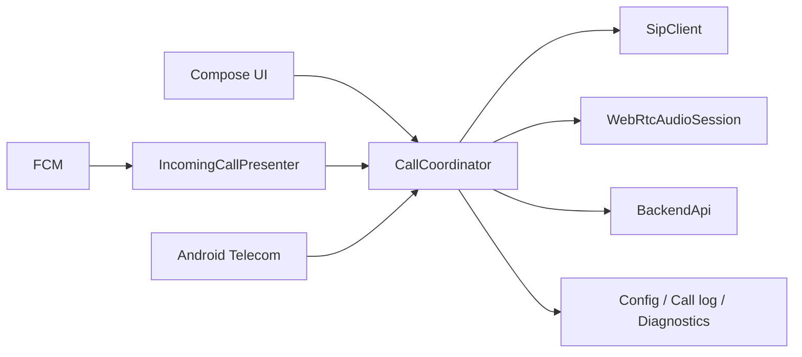
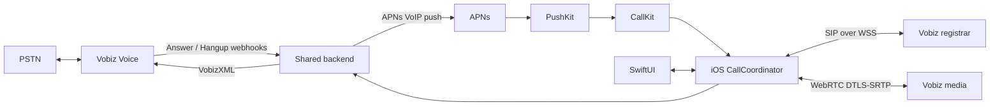
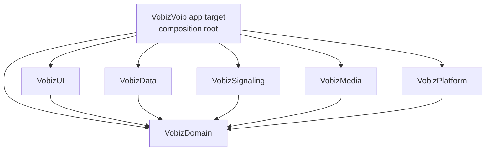

# Vobiz Native iOS Application — Detailed Design

Status: **Proposed — awaiting review and approval**  
Revision: 0.2  
Date: 25 August 2026  
Target: Native iPhone application written in Swift  
Source baseline: Android application, backend, documentation, and screenshots currently in this repository

## 1. Purpose and approval boundary

This document defines a native iOS implementation that preserves the behavior of the existing Android Vobiz VoIP application while using Apple-native lifecycle, calling, push, audio, security, and UI patterns.

No iOS application code should be started until the decisions in section 20 are reviewed. The most important approval items are:

1. iOS 17+ and iPhone-only for the first release;
2. CallKit as the baseline system integration for inbound and outbound VoIP calls, with iOS 26.4+ PushKit metadata honored;
3. PushKit/APNs VoIP push support in the backend;
4. separate, configurable inbound ringing and post-answer join leases;
5. recording policy and default state;
6. the iOS replacement for Android intent and call-log-provider integrations;
7. WebRTC binary/source selection and TURN availability.

### 1.1 Evidence labels

- **Observed** — confirmed in the current Android/backend source.
- **Design decision** — recommended iOS behavior in this document.
- **Approval required** — materially affects product scope, backend behavior, security, or delivery risk.

## 2. Executive summary

### 2.1 Android application as implemented

The repository contains:

- one Android application module (`:app`) written in Kotlin and Jetpack Compose;
- one Node.js/TypeScript backend that handles Vobiz webhooks, short-lived call state, device registration, recording metadata, and FCM delivery;
- a custom SIP client over secure WebSocket;
- WebRTC audio with non-trickle ICE;
- foreground, background, and terminated-process inbound calling through conference parking and push wake-up;
- local recents, contacts, recording playback, settings, and diagnostic logs.

The Android architecture is effectively:



The implementation uses a manual `AppContainer`, not the Hilt/ViewModel structure proposed in the original Android design. The authoritative implementation evidence is:

- application composition: `app/src/main/kotlin/com/enetro/vobizvoip/VobizApplication.kt:126-161`;
- UI routing: `app/src/main/kotlin/com/enetro/vobizvoip/ui/RootScreen.kt:176-232`;
- call state and orchestration: `app/src/main/kotlin/com/enetro/vobizvoip/domain/CallCoordinator.kt:53-85,369-765`;
- as-built call flows: `DOCS/CALL_WORKFLOWS.md:45-293`.

### 2.2 Recommended iOS solution

Build a native Swift application with:

- SwiftUI for application screens;
- CallKit for system call identity and actions;
- PushKit with APNs VoIP notifications for incoming-call wake-up;
- AVAudioSession coordinated with CallKit and WebRTC;
- a narrow Swift port of the current SIP/WSS behavior behind an abstraction;
- structured concurrency and an authoritative `CallCoordinator`;
- Keychain for endpoint credentials and backend token;
- SQLite-backed recents and diagnostic logs;
- the existing backend API and VobizXML call routing, extended with an APNs push adapter and persistent device registrations.



The highest-risk path is an inbound call delivered when the app is suspended or terminated. Apple requires a real VoIP push to be reported promptly to the system calling framework. The current backend expires a pending call after 30 seconds, while Android may spend up to 20 seconds registering SIP after answer. Extending one timer is insufficient: iOS needs a ringing lease and a fresh, bounded post-answer join lease. This must be proven on a physical device before UI polish is treated as proof of feasibility.

## 3. Analysis scope

The design is based on a repository-wide review of:

- all five pre-existing Android/backend documents in `DOCS/`;
- Gradle, manifest, resources, screenshots, and Android tests;
- all user-visible Compose surfaces;
- SIP, SDP, WebRTC, call orchestration, storage, services, Telecom, FCM, and intent/provider integrations;
- backend routes, Vobiz webhook handling, FCM delivery, authentication, and in-memory state;
- current Apple PushKit, CallKit, APNs, and AVAudioSession guidance.

No iOS project or Swift source currently exists in this repository.

## 4. Android as-built assessment

### 4.1 Repository and build

| Area | Current implementation |
|---|---|
| Android module | Single `:app` module |
| Package | `com.enetro.vobizvoip` |
| UI | Jetpack Compose / Material 3 |
| Minimum Android | API 31 / Android 12 |
| Target / compile SDK | 36 |
| Language / runtime | Kotlin 2.2.21, Java 17 |
| Networking | OkHttp 4.12 |
| Media | `io.github.webrtc-sdk:android:144.7559.12` |
| Push | Firebase Messaging + Firebase Installations |
| Backend | Express 5 / TypeScript / Node 22+ |
| DI | Manual `AppContainer` |
| Build variants | Debug and release; no flavors |
| Android automated tests | JVM unit tests only; no instrumented test sources |
| Backend automated tests | Test script configured, but no test files |
| CI | No CI configuration in the repository |

Evidence: `settings.gradle.kts:17-18`, `app/build.gradle.kts:64-195`, `backend/package.json`, the test source trees, and a repository search for CI configuration. `README.md:145-167` documents only local verification and release APK steps.

### 4.2 User-visible surfaces

The iOS product must account for these Android surfaces:

1. first-run endpoint setup;
2. Home / Recents;
3. Keypad;
4. Contacts;
5. Settings;
6. Diagnostic logs;
7. foreground incoming call;
8. active/outgoing call;
9. side menu and clear-history confirmation;
10. system incoming, active-call, and connectivity notifications.

Primary routing evidence: `RootScreen.kt:176-437`.

### 4.3 Current call capabilities

- SIP registration over `wss://registrar.vobiz.ai:5063/` with WebSocket subprotocol `sip`;
- SIP digest authentication;
- `REGISTER`, `INVITE`, `ACK`, `CANCEL`, `BYE`, `OPTIONS`, and `INFO`;
- one active call only;
- outbound PSTN calls;
- inbound conference-park and push-join calls;
- alternate direct SIP INVITE handling;
- mute, speaker, DTMF, hangup, answer, and decline;
- call results: `COMPLETED`, `MISSED`, `DECLINED`, `CANCELED`, and `FAILED`;
- optional recording and recording playback;
- auto-mute while a native cellular call is off-hook.
- direct-SIP inbound marks the call active after sending `200 OK`; it deliberately does not wait for an in-dialog ACK because that ACK is absent on some observed WSS/PSTN paths.

Evidence: `SipClient.kt`, `WebRtcAudioSession.kt`, `CallCoordinator.kt`, and `DOCS/CALL_WORKFLOWS.md`.

### 4.4 Current inbound call path

The shipped backend does not use direct `<Dial><User>` routing for PSTN inbound calls. It always:

1. receives the Vobiz Answer webhook;
2. identifies the endpoint registered for the called DID;
3. creates a 30-second pending call;
4. sends a high-priority FCM data message;
5. parks the PSTN leg in a per-call conference;
6. waits for the app to answer;
7. returns the DID from `/calls/:id/accept`;
8. receives a new SIP leg from the app and joins it to the conference.

Evidence:

- `DOCS/CALL_WORKFLOWS.md:45-122`;
- `backend/src/server.ts:149-230,609-677`;
- `CallCoordinator.kt:478-517,717-735`.

### 4.5 Current outbound call path

1. Normalize the number to E.164.
2. Require SIP registration.
3. `POST /calls/outbound`.
4. Create a WebRTC offer and gather ICE.
5. Send SIP INVITE.
6. Let the backend Answer webhook return `<Dial><Number>`.
7. Apply the remote SDP answer and enter `ACTIVE`.
8. Use CANCEL before answer and BYE after establishment.

Evidence: `DOCS/CALL_WORKFLOWS.md:161-255` and `CallCoordinator.kt:369-380,539-619`.

### 4.6 Current data and storage

| Data | Android storage |
|---|---|
| SIP/backend settings | AES-GCM payload protected by Android Keystore |
| Call history | Plain JSON in SharedPreferences, maximum 200 |
| Diagnostic logs | SQLite, three-day retention |
| Contacts | In-memory cache from device contacts |
| Recording list | Backend response held in memory |
| Recording audio | Streamed through authenticated backend proxy |
| Backend device mappings | In-memory maps |
| Backend pending calls | In-memory maps with 30-second TTL |
| Backend recording metadata | JSON file, maximum 500 |

Evidence: `AppConfig.kt`, `CallLogStore.kt`, `DiagnosticLog.kt`, `ContactsRepository.kt`, and `backend/src/server.ts:84-95`.

### 4.7 Important gaps and contradictions

These are not merely iOS porting concerns; they are source-product decisions:

1. The approved Android design says recording is out of scope and says not to record audio, but the implementation enables recording by default.
2. The original design proposes Hilt and ViewModels; the implementation uses a manual service locator and coordinator state.
3. The original design describes direct inbound `<Dial><User>` behavior; the shipped backend always uses conference parking and push.
4. The app uses only public STUN servers. No TURN server is configured.
5. Backend registrations and pending calls disappear on restart.
6. A single shared static backend bearer token is used by every device.
7. The exported Android call-log provider uses a normal-level permission.
8. `CallPhase.FAILED` remains sticky until another operation resets it.
9. Most Compose strings are hardcoded English, and several controls lack explicit accessibility semantics.
10. There is no CI, no device automation, and no end-to-end backend test suite.

The iOS design intentionally does not reproduce these weaknesses where a safe correction is practical.

## 5. iOS goals, non-goals, and target

### 5.1 Goals

1. Native Swift implementation with no Flutter or embedded web UI.
2. Functional parity for setup, registration, outbound calls, inbound calls, recents, contacts, settings, recordings, and diagnostics.
3. Incoming calls while foregrounded, backgrounded, suspended, or terminated.
4. Apple-native system call behavior through CallKit.
5. Secure handling of endpoint and backend credentials.
6. Deterministic, testable call and registration state machines.
7. Reuse of the existing Vobiz Voice Application and VobizXML routing.
8. A migration path that keeps the existing Android app working.

### 5.2 Non-goals for the first iOS release

- video;
- transfer, hold, merge, or multi-call UI;
- iPad-specific layouts;
- Apple Watch, CarPlay, or macOS;
- requesting the restricted default-calling/default-dialer entitlements in v1;
- a general public cross-app call-log API;
- transcription or AI agent features;
- replacing the backend or Vobiz routing platform;
- production multi-tenant administration.

### 5.3 Proposed target

| Decision | Proposed value |
|---|---|
| Minimum OS | iOS 17.0 |
| Devices | iPhone; portrait-first, landscape supported for active call |
| UI | SwiftUI |
| Language mode | Swift 6 with strict concurrency enabled |
| Bundle identifier | `com.enetro.vobizvoip` if available in the Apple team |
| Display name | Enetro VoIP |
| Distribution first milestone | Development / Ad Hoc / TestFlight |
| Call concurrency | One call |

**Approval required:** minimum iOS version, bundle identifier, iPad scope, and distribution path.

## 6. Architecture

### 6.1 Architectural style

Use a modular, protocol-driven architecture with one authoritative coordinator. UI must not call SIP, WebRTC, PushKit, CallKit, Keychain, or backend clients directly.



Dependency rules:

- `VobizDomain` imports Foundation and Observation only and owns models, protocols, use cases, and `CallCoordinator`.
- adapter modules implement protocols defined by Domain;
- `VobizUI` reads observable domain state and sends user intents;
- only the app target constructs concrete dependencies;
- no concrete adapter imports another concrete adapter;
- CallKit and PushKit callbacks enter through `VobizPlatform`, then dispatch domain intents.

### 6.2 Proposed repository layout

```text
ios/
  VobizVoip.xcodeproj
  Config/
    Debug.xcconfig
    Staging.xcconfig
    Release.xcconfig
  VobizVoip/
    VobizVoipApp.swift
    AppDelegate.swift
    AppContainer.swift
    Assets.xcassets/
    Localizable.xcstrings
    PrivacyInfo.xcprivacy
    VobizVoip.entitlements
  Packages/
    VobizCore/
      Package.swift
      Sources/
        VobizDomain/
        VobizData/
        VobizSignaling/
        VobizMedia/
        VobizPlatform/
        VobizUI/
      Tests/
        VobizDomainTests/
        VobizDataTests/
        VobizSignalingTests/
        VobizMediaTests/
  VobizVoipUITests/
```

One local Swift package with multiple targets is preferred over several independent packages. It preserves boundaries without multiplying manifests and versioning work.

### 6.3 Key protocols

```swift
protocol SipSignalingClient: Sendable {
    var events: AsyncStream<SipEvent> { get }
    func connect(config: SipConfiguration) async
    func disconnect() async
    func invite(destination: String, localSDP: String) async throws
    func acceptIncoming(localSDP: String) async throws
    func rejectIncoming() async
    func cancelOutgoing() async
    func hangup() async
    func sendDTMFInfo(_ digit: Character) async
}

protocol MediaSession: Sendable {
    func createOffer(iceServers: [IceServer]) async throws -> String
    func answer(offer: String, iceServers: [IceServer]) async throws -> String
    func applyAnswer(_ answer: String) async throws
    func setMuted(_ muted: Bool) async
    func setSpeakerEnabled(_ enabled: Bool) async throws
    func sendDTMF(_ digits: String) async -> Bool
    func close() async
}

protocol BackendAPI: Sendable {
    func health(config: AppConfig) async throws -> HealthReport
    func registerDevice(_ registration: DeviceRegistration, config: AppConfig) async throws
    func unregisterDevice(id: UUID, config: AppConfig) async throws
    func setRecordingEnabled(_ enabled: Bool, config: AppConfig) async throws
    func prepareOutbound(destination: String, record: Bool, config: AppConfig) async throws
    func acceptPending(id: UUID, config: AppConfig) async throws -> JoinInstruction
    func declinePending(id: UUID, config: AppConfig) async throws
    func callStatus(id: UUID, config: AppConfig) async throws -> InboundCallStatus
    func iceConfiguration(config: AppConfig) async throws -> IceConfiguration
    func recordings(config: AppConfig) async throws -> [Recording]
    func deleteRecording(id: String, config: AppConfig) async throws
}
```

The final signatures may change during implementation, but the dependency direction must remain.

### 6.4 Composition root

Cold-start bootstrap must be split into a minimal call-reporting layer and a lazy application graph. A terminated-process PushKit launch must not construct Keychain, SQLite, SIP, or WebRTC before the system call is reported.

Immediate bootstrap order:

1. lightweight privacy-safe logger;
2. retained `CXProvider` and its serial delegate queue;
3. availability-selected `PKPushRegistryDelegate`;
4. minimal in-memory call UUID registry;
5. report-required PushKit callback handling.

After the report has been submitted, initialize lazily:

1. secure configuration store;
2. database;
3. backend and SIP clients;
4. WebRTC media adapter and audio-session manager;
5. `CallCoordinator`;
6. SwiftUI root model.

The PushKit callback parses the minimal payload and reports directly through the retained provider before any network request or actor hop. It then starts lazy graph initialization and domain preparation.

### 6.5 Concurrency model

- `CallCoordinator` is `@MainActor` and owns observable UI state.
- `SipClient` is an actor with a single serialized transaction state.
- `BackendAPIClient` uses async `URLSession`.
- WebRTC operations are isolated behind one actor/serial executor because WebRTC callbacks are not assumed to be `Sendable`.
- CallKit uses a dedicated serial delegate queue and bridges actions to the coordinator.
- PushKit reports to CallKit immediately, then starts SIP/backend work in parallel.
- Every session owns one root `Task`; its structured child work covers polling, registration waits, media setup, and pending API work. Ending the session cancels the root task.
- Every asynchronous event and result carries the call UUID plus a session generation. After every `await`, discard work if that session is no longer current.
- Actor isolation does not by itself prevent stale mutations because actors are reentrant.
- Actor event streams must be exposed through a safe nonisolated handle or acquired asynchronously.
- No detached task may mutate call state.

## 7. Application lifecycle and background policy

Android's persistent SIP foreground service cannot be ported directly because iOS may suspend an idle background app.

### 7.1 Lifecycle policy

| App/call condition | iOS behavior |
|---|---|
| Foreground, configured | Maintain SIP registration and backend status |
| Background, no call | Permit suspension; do not depend on a permanent SIP socket |
| VoIP push received | Wake/launch, report CallKit immediately, preload credentials while ringing |
| Incoming call answered | If credentials are ready, call `/accept` first, then register SIP and join within the new join lease |
| Active call | Keep WebRTC and SIP alive under CallKit + background audio |
| Call ended | Stop WebRTC media, report CallKit end, let CallKit deactivate audio, allow suspension |
| App returns active | Refresh backend health, device registration, recordings, and SIP registration |

When backend health changes from offline to online while the process is running, re-register the PushKit token, re-send the recording preference, refresh recordings, and re-check SIP. This maps Android's `recoverBackendSession()`.

Every successful device registration and every configuration save sends the current recording preference—`true` or `false`—to `/devices/recording`. After a `COMPLETED` call, refresh recordings after approximately eight seconds to match backend webhook delay. Entering Home refreshes the list; leaving Home stops playback.

### 7.2 Network monitoring

Use `NWPathMonitor` only while the process is running:

- reconnect SIP when a viable path returns;
- restart backend health checks when foregrounded;
- do not promise continuous background polling;
- during a call, treat network transitions as a reconnect/recovery event and expose a controlled failure if media cannot recover.

Android posts transient background connectivity notifications. iOS v1 intentionally uses in-app SIP/backend status and transition banners only; it does not request standard notification permission merely for connectivity alerts. An opt-in background alert feature can be designed later if product requires it.

### 7.3 Background tasks

`BGAppRefreshTask` may refresh non-urgent status but is not an incoming-call mechanism. PushKit is the only design dependency for terminated/suspended inbound calls.

## 8. CallKit and PushKit design

### 8.1 Mandatory PushKit behavior

For a VoIP push on iOS 17 through the legacy callback:

1. validate the payload shape synchronously;
2. derive the call UUID from `pendingCallId`;
3. create `CXCallUpdate`;
4. call `CXProvider.reportNewIncomingCall`;
5. call the PushKit completion handler after CallKit finishes processing the report;
6. connect SIP and prepare domain state in parallel;
7. never use VoIP pushes for connectivity, recording refresh, marketing, or other non-call events.

If a legacy callback—or a metadata callback with `mustReport == true`—contains malformed or missing required call data, do not silently return. Generate a fallback UUID, report a generic sanitized incoming call, immediately end it as failed, invoke completion exactly once, and persist a provider-contract diagnostic. When `mustReport == false`, complete without creating the fallback call.

Apple requires apps linked against iOS 13+ to report legacy VoIP callbacks to CallKit. Repeated failure can cause process termination and suppression of future VoIP launches.

For iOS 26.4 and later, use an availability-selected delegate implementation for the metadata-bearing PushKit callback. Honor `PKVoIPPushMetadata.mustReport`: report before returning when true; when false, complete promptly and let the coordinator decide whether a foreground in-app call is still viable. Do not implement both old and new callback paths in a way that makes runtime delegate dispatch ambiguous. Physical-device tests must cover both callback families.

Official references:

- [Responding to VoIP Notifications from PushKit](https://developer.apple.com/documentation/pushkit/responding-to-voip-notifications-from-pushkit)
- [Making and receiving VoIP calls](https://developer.apple.com/documentation/callkit/making-and-receiving-voip-calls)
- [Sending notification requests to APNs](https://developer.apple.com/documentation/usernotifications/sending-notification-requests-to-apns)

### 8.2 CallKit configuration

Recommended `CXProviderConfiguration`:

- localized name: `Enetro VoIP`;
- supports video: false;
- maximum calls per group: 1;
- maximum call groups: 1;
- supported handles: phone number;
- custom ringtone only if licensed and approved;
- app icon mask from the production asset;
- calls in system Recents: off by default to match Android's app-owned history.

**Approval required:** whether calls should appear in the iPhone Phone app's Recents list.

### 8.3 One CallKit identity per call

Use the backend `pendingCallId` UUID as the incoming CallKit UUID. Outbound calls receive a client-generated UUID. Store the mapping in `CallSession`.

CallKit and domain must never create two identities for one call.

### 8.4 Incoming answer

On `CXAnswerCallAction`:

1. synchronously validate that the call UUID is current and commit the user's answer intent;
2. fulfill or fail the CallKit action promptly and exactly once;
3. set domain phase to `CONNECTING`;
4. continue setup in the session root task;
5. use already-loaded credentials to call `/calls/:id/accept` first, atomically claiming the call and starting `joinExpiresAt`;
6. ensure SIP registration with a deadline bounded by that join lease;
7. create the WebRTC offer and INVITE the returned join DID within the remaining lease;
8. report a CallKit end with `.failed` if asynchronous setup later fails.

Do not hold a CallKit action open while waiting for Keychain, SIP registration, backend acceptance, ICE, or INVITE. Load Keychain configuration while the call is ringing; if it is unavailable when the user answers, fail the action rather than consume the ring lease waiting for credentials.

### 8.5 Decline/end

On `CXEndCallAction`:

- fulfill the action promptly; do not wait for HTTP decline, CANCEL, or BYE completion;
- pending inbound not joined: call `/calls/:id/decline`;
- outbound before answer: send SIP CANCEL;
- established call: send SIP BYE;
- always close media, cancel polling, persist a call result, and return to `IDLE`.

Backend decline should be idempotent because CallKit, UI, timeout, and Vobiz hangup events can race.

### 8.6 Outbound calls

All outbound calls should use `CXStartCallAction`, even when initiated in SwiftUI:

1. normalize and validate the destination;
2. create a `CallSession`;
3. submit a CallKit transaction;
4. in the provider delegate, validate/commit the start, fulfill promptly, and continue setup in the session task;
5. report `startedConnectingAt`;
6. report `connectedAt` after remote SDP is applied;
7. use the same end transaction as system and in-app controls.

This keeps lock-screen controls, audio activation, Bluetooth behavior, and app state synchronized.

Implement and test every advertised CallKit action:

- start;
- answer;
- end;
- mute;
- DTMF, only if advertised;
- action timeout;
- `providerDidReset`.

On reset, cancel the session root task, stop media, abandon SIP state, persist a controlled terminal result, and clear all system/domain call mappings.

### 8.7 Foreground incoming UI

Legacy and metadata-marked report-required VoIP pushes must be reported to CallKit. If newer metadata says reporting is not required and the foreground call is still viable, SwiftUI may show the branded incoming surface. Whenever both system and app UI exist, they operate on the same UUID and domain session. There must be only one ringtone source.

## 9. SIP signaling design

### 9.1 Transport

- use native `URLSessionWebSocketTask` with protocol `sip` if interoperability passes the protocol spike;
- WSS only;
- one receive loop owned by the SIP actor;
- WebSocket ping every 20 seconds while connected;
- SIP OPTIONS every 60 seconds while registered;
- REGISTER expiry 600 seconds and refresh at 450 seconds, unless Vobiz specifies different values;
- sanitize all SIP log output.

Starscream is a fallback only if native WebSocket framing or subprotocol behavior is incompatible with Vobiz.

### 9.2 Ported capabilities

Port and test:

- SIP message parsing and serialization;
- repeated headers;
- digest MD5 challenge response;
- REGISTER and refresh;
- OPTIONS keepalive;
- INVITE authentication retry;
- provisional 100/180/183;
- ACK, CANCEL, BYE, INFO;
- incoming INVITE 100/180/200, 486, and 488;
- direct-SIP inbound becomes `ACTIVE` after the local `200 OK` is sent and media is ready; do not gate this path on receiving ACK, matching the verified Android interoperability behavior;
- route/contact/dialog handling used by the current Vobiz path;
- status-to-user-error mapping;
- bounded exponential reconnect.

Do not claim full RFC SIP compliance. The client remains a narrow Vobiz adapter behind `SipSignalingClient`.

Direct SIP inbound is supported only while the process is already running and registered. Suspended/terminated inbound must use a VoIP push and the pending-conference path.

### 9.3 Registration policy

```text
DISCONNECTED
  -> CONNECTING
  -> REGISTERING
  -> REGISTERED
  -> REFRESHING

CONNECTING | REGISTERING | REGISTERED | REFRESHING
  -> FAILED
  -> bounded reconnect, unless credentials were rejected
```

Static authentication rejection must stop automatic retries until credentials change or the user explicitly reconnects.

### 9.4 SIP implementation risk gate

Before screen implementation expands, the iOS spike must prove:

1. WSS connection and `sip` subprotocol;
2. digest REGISTER;
3. INVITE authentication;
4. remote SDP receipt;
5. BYE/CANCEL behavior;
6. sanitized packet fixtures that pass unit tests.

## 10. WebRTC and audio design

### 10.1 WebRTC dependency gate

The app needs a maintained iOS WebRTC XCFramework or Swift Package that exposes peer connection, SDP, ICE, audio track, and DTMF APIs. The exact artifact must be selected and pinned during Phase 0 after:

- license review;
- arm64 device and simulator support;
- Swift 6 compatibility;
- symbol and binary-size validation;
- compatibility with Vobiz's SDP.

Do not choose an unmaintained package solely because its import name is `WebRTC`.

### 10.2 Media parity

Preserve Android behavior:

- audio only;
- Unified Plan;
- receive audio, never request video;
- echo cancellation, noise suppression, automatic gain control, and high-pass filtering where supported;
- non-trickle ICE;
- Opus and PCMU only;
- Opus `maxaveragebitrate=48000`;
- three ICE gathering attempts;
- begin with Android's 1.2-second early-ready delay after the first candidate, instrument it, and change it only with Vobiz/device evidence;
- DTMF through WebRTC sender with SIP INFO fallback;
- full resource release at call end.

Evidence: `WebRtcAudioSession.kt:46-128,130-287,289-324`.

### 10.3 ICE/TURN

The current app is STUN-only:

- `stun:stun.l.google.com:19302`;
- `stun:stun.cloudflare.com:3478`;
- `stun:global.stun.twilio.com:3478`.

The iOS POC may begin with the same servers for parity, but restrictive-network acceptance requires TURN or explicit confirmation from Vobiz that its media topology makes client TURN unnecessary.

TURN credentials must be short-lived and obtained from a new authenticated endpoint such as `GET /ice/config`, returning URLs, username, credential, and expiry. Static TURN secrets must not ship in the app.

ICE gathering has one call-scoped deadline. Three full 20-second attempts cannot be allowed to overrun a pending join lease; remaining time must be checked before each retry.

### 10.4 AVAudioSession and WebRTC

Use CallKit-controlled audio activation:

1. configure category `.playAndRecord`;
2. use a voice-call mode such as `.voiceChat`;
3. allow Bluetooth HFP routes;
4. do not activate WebRTC audio before CallKit calls `provider(_:didActivate:)`;
5. set WebRTC to manual-audio mode where supported;
6. enable WebRTC audio only after CallKit activation;
7. on `didDeactivate`, disable the WebRTC audio unit but retain the peer connection because deactivation may be transient;
8. destroy peer connection/media only when the call ends or CallKit resets the provider.

Default route is receiver/Bluetooth. Speaker toggle explicitly overrides to speaker and restores the system route when disabled.

Handle:

- route changes;
- headset removal;
- audio interruption began/ended;
- media-services reset;
- CallKit activation/deactivation;
- microphone permission revocation;
- native cellular calls through CallKit observation where available.

Apple reference: [AVAudioSession.Category.playAndRecord](https://developer.apple.com/documentation/avfaudio/avaudiosession/category-swift.struct/playandrecord).

## 11. Authoritative domain state

### 11.1 Call session

```swift
struct CallSession: Equatable, Sendable {
    let id: UUID
    let generation: UInt64
    let direction: CallDirection
    let source: CallSource
    let remoteNumber: String
    let startedAt: Date
    var connectedAt: Date?
    var pendingCallID: UUID?
    var result: CallResult?
}
```

`CallSource` distinguishes outbound, pending-push inbound, and direct-SIP inbound.

### 11.2 Call phases

```text
IDLE
  -> OUTGOING | INCOMING
OUTGOING
  -> RINGING | CONNECTING | ENDING | FAILED
INCOMING
  -> CONNECTING | ENDING | FAILED
RINGING
  -> CONNECTING | ACTIVE | ENDING | FAILED
CONNECTING
  -> ACTIVE | ENDING | FAILED
ACTIVE
  -> ENDING | FAILED
ENDING
  -> IDLE
FAILED
  -> IDLE
```

Unlike Android, `FAILED` is terminal for the current session, not a persistent app mode. Failure handling must:

1. close resources;
2. report CallKit end;
3. write a failed call log if a session exists;
4. publish a sanitized error event;
5. return to `IDLE`.

Registration state, backend health, and call phase remain separate.

### 11.3 Event ownership

All events are reduced by `CallCoordinator`:

- user intents;
- CallKit actions;
- PushKit incoming calls;
- SIP events;
- WebRTC failures;
- backend results;
- network changes;
- inbound-status polling;
- audio interruptions.

UI observes state but never performs an independent phase transition.

### 11.4 Race and idempotency rules

- duplicate VoIP push for one UUID updates the existing call; it does not create another call;
- answer after expiry fails cleanly and reports remote-ended;
- decline and timeout can run more than once without error;
- remote hangup during local answer cancels setup;
- CallKit end and SIP BYE may arrive in either order;
- every CallKit action is fulfilled or failed exactly once and promptly;
- every result received after an `await` is ignored unless UUID and generation still match;
- only one call may own the media session;
- a second incoming call is reported as busy/declined consistently;
- teardown is safe to call repeatedly.

## 12. Backend and APNs changes

The existing VobizXML routing remains reusable. iOS requires backend push and registration changes.

### 12.1 Push abstraction

Refactor backend push delivery behind:

```text
IncomingCallPushSender
  - FirebaseIncomingCallPushSender
  - ApnsVoipIncomingCallPushSender
```

Routing uses the registered device platform. Android behavior must remain backward-compatible.

### 12.2 Device registration contract

Extend `POST /devices/register` as a backward-compatible schema union. The legacy Android shape has no `platform`, so the server identifies it by `installationId`; all new clients send an explicit platform.

Android request remains valid:

```json
{
  "endpoint": "endpoint-user",
  "installationId": "firebase-installation-id",
  "callerId": "+919876543210"
}
```

New iOS request:

```json
{
  "platform": "ios",
  "endpoint": "endpoint-user",
  "deviceId": "stable-app-installation-uuid",
  "voipToken": "hex-encoded-pushkit-token",
  "callerId": "+919876543210"
}
```

The APNs environment and topic come from the authenticated backend deployment and signing channel, not a free-form client field. Debug points to a sandbox-configured backend; TestFlight and Release point to production-configured backends.

The first-release policy is **one active app installation per SIP endpoint**. Registering a new installation atomically invalidates the old one. Supporting multiple devices requires a separate fan-out/answer-winner design and is not implicit.

Persist each registration with platform, device ID, endpoint owner, token/FID, topic, APNs environment, created/updated timestamps, and invalidation state.

Every API request binds to the authenticated active installation ID and registration version. Replacing an installation revokes the previous API session. If one-device-per-endpoint is also a SIP security invariant, rotate endpoint credentials or obtain proof that the registrar replaces old contacts; invalidating only the push record does not disconnect an old SIP registration.

Add an authenticated unregister operation for token invalidation or sign-out. APNs `410 Unregistered` responses must remove stale tokens only when their timestamp is newer than the stored token update.

### 12.3 APNs provider behavior

Use APNs token-based authentication with a `.p8` key stored only on the backend.

Required request behavior:

- HTTP/2 TLS to APNs;
- `apns-push-type: voip`;
- `apns-topic: <bundle-id>.voip`;
- `apns-priority: 10`;
- `apns-expiration: 0` for immediate-only call delivery, or a deliberately short epoch-seconds value no later than ring expiry;
- sandbox endpoint `api.sandbox.push.apple.com` only for development tokens;
- production endpoint `api.push.apple.com` for TestFlight and release tokens;
- unique APNs ID logged for diagnostics;
- no retries after the pending call expires.

Treat PushKit tokens as opaque and changeable. Register every token update and handle APNs bad-token, wrong-topic/environment, throttling, transient failure, and `410 Unregistered` classes explicitly.

### 12.4 VoIP payload

Version the payload:

```json
{
  "aps": {},
  "schemaVersion": 1,
  "type": "inbound_call",
  "pendingCallId": "2df50172-6fca-4faa-8b65-480ec8cfe12d",
  "caller": "+919812345678",
  "expiresAt": 1787632495000
}
```

`pendingCallId` is the CallKit UUID. Keep the payload minimal. Do not include SIP password, backend token, conference name, or Vobiz account credentials.

### 12.5 Persistence

Before background/terminated iOS acceptance:

- persist device registrations across backend restarts;
- persist pending calls with separate ring and join leases;
- make state transitions atomic and accept/decline idempotent;
- support both APNs sandbox and production environments;
- retain Android FCM registration behavior.

SQLite is sufficient for a single-node POC. Redis or a database with TTL/locking is recommended for multiple backend instances.

### 12.6 Pending-call timeout

Current implementation has one 30-second deadline from call creation (`server.ts:624`). Accepting near that deadline can succeed and then expire before the SIP leg joins.

Replace it with two leases:

1. `ringExpiresAt` — starts when the PSTN call is parked; proposed initial value 45 seconds;
2. `joinExpiresAt` — starts only after an atomic `ringing -> accepted` transition; proposed initial value 25 seconds.

`/accept` performs compare-and-set, stores the fresh join lease, and returns it with the join DID. `joined`, `declined`, and `expired` transitions are durable and mutually exclusive. Only the answer winner may join. Expiry releases the Vobiz leg.

The ring lease covers APNs delivery, process launch, CallKit report, user response, and credential preload. The join lease starts when `/accept` atomically claims the call and covers accept completion, SIP REGISTER, ICE, and INVITE. If credentials are unavailable at answer, fail and end the CallKit call without accepting.

**Approval required:** ring lease, join lease, maximum ringing/cost policy, and one-device-per-endpoint policy.

### 12.7 Health response

Keep the existing `firebase` field for Android compatibility and add explicit push capability:

```json
{
  "status": "ok",
  "firebase": true,
  "push": {
    "androidFcm": true,
    "iosApnsVoip": true
  },
  "pendingCalls": 0,
  "registeredEndpoints": 2
}
```

## 13. App/backend API contracts

### 13.1 Existing reusable endpoints

| Endpoint | Purpose | iOS behavior |
|---|---|---|
| `GET /health` | Backend/push readiness | Decode old and extended response |
| `POST /devices/register` | Endpoint, DID, push mapping | Send iOS VoIP token shape |
| `POST /devices/recording` | Recording preference | Reuse |
| `POST /calls/outbound` | Store destination/caller/record intent | Reuse with explicit `record` |
| `GET /calls/:id` | Pending call metadata | Optional debug/recovery; unused by Android UI |
| `POST /calls/:id/accept` | Return join DID and join expiry | Evolve to atomic transition |
| `POST /calls/:id/decline` | Terminate pending inbound | Evolve to idempotent transition |
| `GET /calls/:id/status` | Detect remote PSTN hangup | New call-scoped replacement for endpoint-global status |
| `GET /ice/config` | Short-lived STUN/TURN configuration | New production-media endpoint |
| `GET /recordings` | Recording metadata | Reuse |
| `GET /recordings/:id/audio` | Authenticated audio proxy | Reuse after owner check and Range support |
| `DELETE /recordings/:id` | Delete recording metadata and media | New owner-authorized, idempotent endpoint |

Authentication remains:

```text
Authorization: Bearer <backendToken>
X-Vobiz-Endpoint: <sipUsername>
```

That identity contract is POC compatibility only. Before production, the authenticated token subject—not a body field or `X-Vobiz-Endpoint` supplied by the client—must authorize the endpoint.

Current backend security gaps to close:

- pending lookup and decline must verify call ownership;
- accept must authorize the subject, not trust the submitted endpoint;
- recording list and audio ID must verify endpoint ownership;
- inbound status must be call-scoped;
- device registration must verify that the subject may claim the SIP endpoint and DID.

### 13.2 HTTP client behavior

- `URLSession` async/await;
- ephemeral or explicitly controlled cache policy for call-control requests;
- request timeout appropriate to the operation;
- cancellation propagated from call task;
- no automatic retry of non-idempotent call-control POSTs unless an idempotency key is used;
- JSON decoder tolerant of additive backend fields;
- sanitized typed errors for UI;
- full status/path/timing only in diagnostics, never auth headers or bodies containing secrets.
- recording playback streams with owner checks and HTTP Range support instead of buffering the whole media file.

### 13.3 Idempotency

Add `Idempotency-Key` for:

- device registration;
- outbound preparation;
- pending accept;
- pending decline.

At minimum, pending accept/decline must be keyed by pending call and the authenticated active installation—not endpoint text supplied by the client.

## 14. Configuration and secure storage

### 14.1 Configuration model

Preserve:

- SIP username;
- SIP password;
- registrar WSS URL;
- SIP domain;
- backend HTTPS URL;
- backend token;
- caller ID;
- recording preference;
- diagnostic logging preference;
- default dialing region.

Validate with parsed URLs, not string prefixes alone:

- registrar scheme `wss`, non-empty host;
- backend scheme `https`, non-empty host;
- E.164 `^\+[1-9]\d{7,14}$`;
- no whitespace in SIP username/domain;
- backend token length consistent with server policy.

### 14.2 Keychain

Store sensitive configuration as a versioned Codable payload in Keychain:

- accessibility: `AfterFirstUnlockThisDeviceOnly`, so a VoIP push can read it while the device is locked after first unlock;
- after reboot and before first unlock, treat `errSecInteractionNotAllowed` as a controlled unavailable-call result and end the reported call cleanly;
- no iCloud synchronization;
- update atomically;
- delete on explicit reset/sign-out;
- never include secrets in UserDefaults, logs, crash metadata, previews, or test fixtures.

Non-sensitive preferences such as UI theme may use UserDefaults.

Keychain items may survive app uninstall/reinstall. Store an installation marker outside Keychain and define first-launch-after-reinstall behavior: either purge stale credentials and unregister the prior device or explicitly offer recovery. The app's default Keychain group requires no Keychain Sharing capability; enable a shared access group only if an approved extension or companion app needs it.

### 14.3 Environment configuration

Use `.xcconfig` files for:

- backend default URL;
- registrar defaults;
- bundle display suffix;
- log level.

Never place SIP credentials, backend bearer tokens, APNs private keys, or Vobiz account credentials in `.xcconfig`.

## 15. Local data design

### 15.1 SQLite database

Use one SQLite database actor with schema migrations and WAL.

`call_log`:

```text
id TEXT PRIMARY KEY
number TEXT NOT NULL
direction TEXT NOT NULL
result TEXT NOT NULL
started_at_ms INTEGER NOT NULL
connected_at_ms INTEGER
duration_seconds INTEGER NOT NULL
recording_id TEXT
```

Retain newest 200 entries for parity unless product approves a larger limit.

`diagnostic_log`:

```text
id INTEGER PRIMARY KEY AUTOINCREMENT
timestamp_ms INTEGER NOT NULL
level TEXT NOT NULL
category TEXT NOT NULL
message TEXT NOT NULL
call_id TEXT
```

Retain three days and cap query/export size.

Use `NSFileProtectionCompleteUntilFirstUserAuthentication` for the database directory and its WAL/SHM sidecars so lock-screen call teardown can write after first unlock. Exclude recents/diagnostics from backup unless migration is explicitly approved. Resolve contact display names dynamically rather than persisting an address-book copy.

### 15.2 Recording matching

The Android app matches by direction, last ten digits, and a five-minute window. This can mis-associate calls.

Preferred backend change: return a stable call/session correlation ID with recording metadata and persist that ID in the call log. Use the Android heuristic only as a compatibility fallback.

### 15.3 Contacts

Use `CNContactStore`:

- request access when Contacts is first opened or contact search is used;
- support iOS 18+ limited Contacts authorization and `ContactAccessButton`/system access picker;
- cache display name and normalized phone values in memory;
- react to contact-store changes;
- recheck authorization and refetch allowed contacts whenever the scene becomes active; immediately purge cached contacts removed from limited access;
- do not copy the address book into the app database;
- never delay the initial CallKit report for contact lookup; report the number first and update later if a permitted match resolves;
- no contacts permission is required to place a manually entered call.

### 15.4 Number normalization

Port the existing normalization rules:

- `+` international remains unchanged;
- `00` becomes `+`;
- leading national `0` becomes `+<country code>`;
- bare national digits receive `+<country code>`;
- `*` and `#` remain unchanged for feature codes, though PSTN call validation still requires E.164.

iOS cannot reliably depend on SIM country in all device/eSIM configurations. Android's observed precedence is SIM ISO, then Settings default, then `IN`. The following is a deliberate iOS platform adaptation:

1. explicit default country selected by the user;
2. current device locale region;
3. `IN` / `+91` compatibility fallback.

The Settings copy should say “device region,” not “SIM,” unless a proven carrier API is added. Port Android normalization test vectors and add explicit tests for this precedence difference.

## 16. UI and interaction design

### 16.1 Information architecture

Preserve the Android two-tab model:

- Home;
- Keypad.

Use a native toolbar menu to open Contacts, Settings, Diagnostic Logs, and Clear History. This is a deliberate iOS UX adaptation of the Android side drawer, while preserving the same feature hierarchy.

### 16.2 Screen specifications

#### A. Setup

States:

- incomplete;
- validating;
- saved but SIP connecting;
- SIP registered/backend online;
- invalid credentials;
- backend unreachable;
- push token not yet registered.

The setup surface retains Android's branded header plus the complete Settings form rather than introducing a separate reduced wizard. Fields match section 14. Save remains disabled until local validation passes. Saving must not imply successful registration.

After configuration, show a one-time inbound-readiness explanation if microphone access, PushKit registration, or backend device registration is incomplete. Standard notification authorization is not a CallKit/PushKit prerequisite and is not an inbound gate.

Request microphone permission proactively while the app is foregrounded during setup; do not first prompt from a locked/background CallKit answer.

#### B. Home / Recents

- search contacts;
- when a search contains at least three digits, show a callable “Call {query}” row even without a contact match;
- group calls by Today, Yesterday, and Older;
- show direction, result, relative time, duration, contact name/number;
- tap row to prefill Keypad;
- call button redials;
- recording play/stop/progress where available;
- loading, no-history, no-search-match, playback-error states;
- destructive clear action requires confirmation.
- show a visible SIP connection banner on Home and Keypad whenever registration is not ready, with reconnect action;
- present sanitized transient errors using an iOS banner/alert equivalent to Android's Snackbar.

#### C. Keypad

- digits 0–9, `*`, `#`;
- letters beneath digits;
- long-press 0 for `+`;
- delete and long-press clear;
- contact matches while typing;
- call disabled unless number exists and SIP is registered;
- VoiceOver announces digit and associated letters;
- all touch targets at least 44×44 points.

#### D. Contacts

- permission not determined, limited, authorized, denied, restricted, empty, populated, and search states;
- request/open Settings actions where appropriate;
- row and call accessory initiate the same outbound intent.

#### E. Settings

Sections:

1. Status: SIP, backend, and VoIP push registration.
2. Inbound readiness: PushKit token, backend device registration, and microphone.
3. SIP endpoint.
4. Backend.
5. Dialing/default region.
6. Call recording.
7. Diagnostics.
8. Reset local configuration — an intentional iOS-only safety feature, not current Android UI parity.

Android battery-optimization and full-screen-intent controls have no direct iOS equivalent and must not be copied.

#### F. Incoming call

- CallKit is authoritative;
- foreground branded view shows caller, answer, and decline for the same UUID;
- lock-screen/system Answer maps directly to the same coordinator intent without requiring the custom screen;
- no second ringtone;
- expired/remote-ended state dismisses immediately.

#### G. Active/outgoing call

- caller/number;
- Calling, Ringing, Connecting, In Call, Ending;
- elapsed time from `connectedAt`;
- mute, speaker/audio route, and keypad controls enabled only after `ACTIVE`;
- toggleable DTMF keypad with an explicit Hide action;
- hangup;
- system CallKit actions mirror state immediately.

Hold, transfer, merge, and add-call controls are omitted.

CallKit lock-screen/system controls replace Android's ongoing foreground-service notification and its Hang up action.

#### H. Diagnostic logs

- one-hour, two-hour, and custom ranges;
- start/end validation;
- refresh;
- share sanitized export;
- clear with confirmation;
- logging-disabled banner with Settings link.

### 16.3 Visual system

Preserve brand semantics from Android:

| Token | Value |
|---|---|
| Primary terracotta | `#C9460B` |
| Dark primary | `#8F2E00` |
| Light primary | `#FF8A5C` |
| Answer | `#14B26B` |
| Decline | `#E5484D` |
| Warning | `#E8A317` |
| Light background | `#FAF7F5` |
| Dark background | `#121110` |
| In-call backdrop top | `#2A1206` |
| In-call backdrop bottom | `#121110` |

Implement as named asset colors with light/dark variants. Use semantic colors for text and surfaces rather than copying every Android hex into view code.

### 16.4 Accessibility

Required from the first implementation:

- Dynamic Type without clipped keypad or call controls;
- VoiceOver labels, values, hints, and selected states;
- correct focus movement when call phase changes;
- sufficient contrast in light/dark mode;
- reduced-motion behavior for pulsing incoming avatar;
- differentiation beyond color for status;
- 44-point minimum interactive targets;
- accessible duration and phone-number pronunciation;
- no decorative icon exposed as an unlabeled control.

### 16.5 Localization

Use String Catalogs. No user-facing text is hardcoded in Swift.

Initial locale may be English, but formatting must use:

- locale-aware relative dates;
- localized duration;
- phone numbers kept left-to-right;
- pluralization for pending calls and durations;
- RTL-safe layout.

## 17. iOS system integrations

### 17.1 Required capabilities and entitlements

- Push Notifications;
- Background Modes: Voice over IP and Audio;
- `aps-environment` through the signing profile;
- Associated Domains only if universal-link dialing is approved.

No Keychain Sharing entitlement is needed for the app's default Keychain access.

### 17.2 Info.plist/privacy declarations

At minimum:

- `NSMicrophoneUsageDescription`;
- `NSContactsUsageDescription`;
- background modes for `voip` and `audio`;
- custom URL type if app-to-app dialing is approved.

Include `PrivacyInfo.xcprivacy` and audit the selected WebRTC binary's privacy manifest before distribution.

Do not add unrelated permission strings.

### 17.3 App-to-app dialing

The Android contracts map as follows:

| Android entry | iOS v1 mapping |
|---|---|
| `ACTION_DIAL` with optional `tel:` | custom/universal link with `autoCall=false` |
| `ACTION_VIEW` / `ACTION_CALL` with `tel:` | custom/universal link with confirmation |
| explicit `com.enetro.vobizvoip.action.CALL` | custom/universal link with confirmation or signed request |

iOS now has restricted default-calling/default-dialer entitlements through LiveCommunicationKit, including regional/eligibility constraints. This v1 does not request them, so arbitrary `tel:` routing remains out of scope.

Proposed contract:

```text
vobizvoip://dial?number=%2B919876543210&autoCall=false
vobizvoip://dial?number=%2B919876543210&autoCall=true
```

Validate all incoming URL values. A custom URL scheme does not provide trustworthy caller identity, and a universal link prevents scheme hijacking but does not authenticate the invoking app. Always require confirmation for `autoCall=true` unless the request contains a backend-validated authorization that is destination-bound, audience-bound, short-lived, and single-use through server-side nonce consumption. Never allow confirmation-free calling from an unsigned custom-scheme URL.

Optional production alternative: universal link on a controlled HTTPS domain.

### 17.4 Call-log integration gap

iOS has no public equivalent to Android's exported `ContentProvider`.

Options:

1. app-owned call history only — recommended first release;
2. App Group database for companion apps signed by the same Apple team;
3. user-initiated JSON/CSV export;
4. CallKit system Recents, if approved.

Android also lets another permitted app stream recording audio through the provider. iOS v1 does not expose an equivalent recording stream; an App Group or user-initiated export/download must be separately designed.

**Approval required:** whether another iOS app must read Enetro VoIP call history or recording streams.

## 18. Security, privacy, and compliance

### 18.1 Required controls

- HTTPS/WSS only and App Transport Security enabled;
- endpoint credentials and backend token in Keychain;
- Vobiz Auth ID/Auth Token and APNs private key only on backend;
- no secrets in source, IPA resources, diagnostics, screenshots, or analytics;
- redaction of SIP Authorization, SDP, tokens, APNs tokens, and phone numbers;
- per-call correlation IDs instead of raw identity in logs;
- backend input validation and body limits;
- owner authorization for every device, call, status, recording metadata, and recording-audio operation;
- rate limits and maximum call duration;
- destination allowlist for non-production testing;
- idempotent call-control endpoints;
- explicit reset that removes local credentials and unregisters push token.

### 18.2 Current shared token

The current `DEVICE_TOKEN` is shared by all devices. It is acceptable only for a tightly controlled POC.

Production design must replace it with:

- authenticated per-user/device bootstrap;
- short-lived access token;
- rotation/revocation;
- endpoint authorization on every call-control request.

### 18.3 Webhook authenticity

Current webhook protection is a secret URL token. Confirm whether Vobiz supports request signatures. If not:

- use a high-entropy token;
- rate limit;
- log and alert on invalid patterns;
- restrict source networks if Vobiz publishes stable ranges;
- implement replay/idempotency checks using CallUUID.

### 18.4 Recording

The repository's approved Android design says no recording, while the current app records by default.

Recommended iOS policy:

- include the recording capability for parity;
- default it off until consent, retention, jurisdiction, and privacy policy are approved;
- obtain explicit user consent and show a clear visual and/or audible indication whenever recording is active, per App Review Guideline 2.5.14;
- do not start recording until consent is confirmed; keep an in-app indicator visible and use an audible start/stop indication when the app UI is not continuously visible;
- keep recording media server-side and stream through the authenticated proxy;
- provide owner-authorized, idempotent deletion of metadata and upstream media through `DELETE /recordings/:id`; if Vobiz cannot delete upstream media, disclose and enforce the provider retention limit;
- document one-party/two-party consent rules for target jurisdictions;
- link the privacy policy from the app;
- disclose phone numbers, contacts, call audio, and diagnostics accurately in App Privacy;
- complete export-compliance classification for bundled WebRTC DTLS/SRTP before TestFlight;
- send explicit `record: false` on outbound and `/devices/recording enabled:false` on registration/save/recovery when disabled, because the current backend otherwise defaults recording to true.

**Approval required:** recording inclusion, default, consent copy, and retention.

### 18.5 Diagnostics

- disabled by default;
- three-day local retention;
- redact phone numbers except a minimal suffix;
- never store SIP credentials, auth headers, SDP, APNs token, or recording URLs;
- user-controlled export;
- export includes app version, iOS version, device class, time range, and correlation IDs.

## 19. Observability, testing, CI, and release

### 19.1 Logging

Use `Logger` / unified logging with categories:

- lifecycle;
- push;
- CallKit;
- SIP;
- media;
- backend;
- call state;
- persistence.

Persist only approved sanitized diagnostic events when diagnostics are enabled.

### 19.2 Unit tests

Port Android fixtures for:

- phone-number normalization;
- SIP parser/serializer;
- repeated SIP headers;
- digest authentication;
- reconnect delay;
- SDP codec filtering;
- call result derivation.

Add:

- full `CallCoordinator` transition tests using protocol fakes;
- duplicate push, expiry, decline/answer race, remote hangup race;
- malformed required-to-report push and completion-exactly-once behavior;
- `/accept` racing `ringExpiresAt` and concurrent accept compare-and-set;
- Keychain store tests;
- old-install revocation and active-registration-version tests;
- SQLite migration/retention plus locked-device WAL/SHM write tests;
- limited-contact removal and cache purge tests;
- signed URL nonce replay tests;
- recording consent, indication, deletion, and deletion-authorization tests;
- backend client auth-header and error mapping tests with `URLProtocol`;
- APNs payload schema tests in the backend.

### 19.3 Integration tests

- local mock SIP WebSocket server for REGISTER/challenge/INVITE fixtures;
- backend contract tests against the Express app without opening a real port;
- APNs sender tests with a fake provider;
- CallKit adapter tests around action-to-domain mapping;
- WebRTC SDP tests using captured sanitized fixtures.

### 19.4 Physical-device matrix

Required manual evidence:

- minimum supported iOS and latest supported iOS;
- at least one older and one current iPhone class;
- Wi-Fi, cellular, restrictive Wi-Fi;
- foreground, background, locked, suspended, and terminated;
- OS-terminated and user-force-quit states tested and documented separately;
- Bluetooth headset connect/disconnect;
- speaker/receiver switching;
- denied/revoked microphone and full/limited/denied contacts;
- network loss and Wi-Fi/cellular transition;
- backend restart;
- APNs sandbox and TestFlight production environment;
- caller decline, caller timeout, remote hangup, app hangup, busy, invalid credentials.
- legacy PushKit callbacks and iOS 26.4+ metadata/`mustReport` behavior;
- malformed, duplicate, delayed, and expired VoIP pushes;
- answer at ring expiry and post-answer join expiry;
- APNs token rotation, wrong environment/topic, and `410 Unregistered`;
- reboot before first unlock and unavailable Keychain credentials;
- first microphone permission flow before an incoming call;
- CallKit action timeout, `providerDidReset`, and missing/transient audio activation;
- negative owner-authorization tests for every call and recording endpoint.

### 19.5 Acceptance criteria

- [ ] SIP registers without Vobiz account credentials in the app.
- [ ] Five consecutive outbound calls connect with two-way audio.
- [ ] Five consecutive foreground inbound calls ring and connect.
- [ ] Five consecutive locked/background inbound calls ring through CallKit.
- [ ] Five consecutive terminated-app inbound calls ring through CallKit.
- [ ] Legacy PushKit and iOS 26.4+ metadata callback paths obey their report/completion contracts.
- [ ] Answer, decline, mute, speaker, DTMF, and hangup work.
- [ ] CallKit and in-app UI never disagree about call identity or state.
- [ ] CallKit actions are completed promptly and exactly once, independent of later SIP/HTTP results.
- [ ] Call teardown releases microphone, audio session, SIP dialog, and WebRTC resources.
- [ ] Ring and join lease boundaries, duplicate push, answer/decline race, and remote-hangup race are deterministic.
- [ ] Recents result/duration are correct for all terminal paths.
- [ ] Recording playback works when recording is approved and enabled.
- [ ] Bad credentials, backend down, push failure, timeout, busy, ICE failure, and permission denial are controlled.
- [ ] Wi-Fi and cellular two-way audio pass.
- [ ] TURN/restrictive-network criterion is resolved before production acceptance.
- [ ] No secrets or unredacted sensitive payloads appear in source, IPA, normal logs, or exports.

### 19.6 CI

Add a macOS CI workflow that runs:

1. Swift package unit tests;
2. `xcodebuild test` on an iOS simulator;
3. release build without signing;
4. Android unit tests/build to prevent backend contract regressions;
5. backend typecheck and tests;
6. secret scanning and dependency audit.

Live APNs, SIP, WebRTC, and PSTN tests remain a controlled device pipeline, not ordinary pull-request CI.

### 19.7 Build configurations

Use Debug, Staging, and Release:

| Configuration | APNs | Backend | Logging |
|---|---|---|---|
| Debug, development-signed | Sandbox | Local/tunnel or staging | Verbose, sanitized |
| Staging | Determined by signing: development = sandbox; Ad Hoc/TestFlight = production | Staging HTTPS matching token environment | Diagnostic |
| Release, App Store/TestFlight | Production | Production HTTPS | Minimal |

APNs environment is determined by the signing entitlement, not by the Xcode configuration name. Do not register a sandbox token against the production APNs sender or vice versa.

## 20. Delivery phases and approval decisions

### Phase 0 — feasibility and protocol spike

Deliver:

- Xcode shell and package boundaries;
- Keychain/config model;
- native WSS SIP REGISTER;
- pinned WebRTC dependency;
- outbound SDP fixture compatibility;
- APNs development credential and one VoIP push reported to CallKit;
- legacy and iOS 26.4+ PushKit callback strategy;
- backend design proof for platform-specific registrations.

Exit: SIP registration and a real development VoIP push are both demonstrated on a physical iPhone.

### Phase 1 — outbound call core

Deliver:

- backend client;
- WebRTC offer/answer;
- CallKit outbound transaction;
- SIP INVITE/ACK/CANCEL/BYE;
- active-call controls;
- core call-state tests.

Exit: five consecutive outbound two-way calls.

### Phase 2 — foreground inbound

Deliver:

- APNs sender;
- PushKit registry;
- CallKit incoming report;
- pending accept/decline;
- atomic ring-to-accepted state transition;
- conference join;
- remote-hangup polling.

Exit: five consecutive foreground inbound calls.

### Phase 3 — background and terminated inbound

Deliver:

- durable device registration;
- separate configurable ring and join leases;
- cold-start composition root;
- lock-screen answer/decline;
- APNs failure/token invalidation handling;
- background audio activation.

Exit: physical-device acceptance for locked, suspended, and terminated states.

### Phase 4 — feature/UI parity

Deliver:

- setup, Home, Keypad, Contacts, Settings;
- recents/database;
- recording playback if approved;
- diagnostic viewer/export;
- URL integration;
- localization and accessibility baseline.

Exit: feature traceability matrix complete.

### Phase 5 — hardening and TestFlight

Deliver:

- TURN or approved media topology;
- security/privacy review;
- backend call/recording owner authorization;
- backend idempotency/rate limits;
- CI;
- multi-network and interruption testing;
- privacy manifest and TestFlight build.

Exit: all acceptance criteria pass.

### 20.1 Decisions requested from reviewer

| # | Decision | Recommendation |
|---|---|---|
| 1 | Minimum OS | iOS 17.0 |
| 2 | Device scope | iPhone first; iPad later |
| 3 | Bundle ID | `com.enetro.vobizvoip` if available |
| 4 | UI framework | SwiftUI with system-framework adapters |
| 5 | System calling | CallKit baseline for inbound and outbound; honor newer PushKit metadata |
| 6 | System Recents | Off initially; app-owned history |
| 7 | Incoming push | Native PushKit/APNs VoIP, not FCM |
| 8 | Inbound leases | Ring 45s + fresh join 25s, both configurable |
| 9 | Backend persistence | Required before terminated-call acceptance |
| 10 | Recording | Capability retained, default off until policy approval |
| 11 | External dialing | Custom URL scheme first; universal link optional |
| 12 | External call log | None in v1; App Group only if a companion app requires it |
| 13 | TURN | Required or explicitly waived by Vobiz before production |
| 14 | Authentication | Shared bearer token for POC only; per-device auth for production |
| 15 | Distribution | TestFlight before App Store |
| 16 | Endpoint/device policy | One active installation per SIP endpoint |

### 20.2 Open technical/vendor questions

1. Does Vobiz provide or recommend a maintained native iOS SIP/WebRTC SDK?
2. Which iOS WebRTC binary and exact version will be supported?
3. What codecs, SDP attributes, and DTMF mode does Vobiz guarantee?
4. Does Vobiz provide TURN and short-lived credentials?
5. Does Vobiz support webhook signatures?
6. Are 45-second ringing and 25-second post-answer join leases acceptable for conference cost and routing?
7. Is one SIP endpoint strictly one device, including reinstalls?
8. Is direct SIP inbound retained only as a fallback, or required for iOS?
9. Must another iOS app initiate calls without user confirmation?
10. Must another iOS app read call history or recording streams?
11. Should completed calls appear in Apple's Phone Recents?
12. What recording consent and retention rules apply to target countries?
13. Should a future release pursue Apple's restricted default-calling/default-dialer entitlements?

## 21. Traceability matrix

| Android capability/source | iOS component |
|---|---|
| `VobizApplication` / `AppContainer` | `AppDelegate` + `AppContainer` |
| `RootScreen` state routing | SwiftUI `RootView` + observable coordinator |
| `CallCoordinator` | `@MainActor CallCoordinator` |
| `SipClient` | `SipClient` actor |
| `WebRtcAudioSession` | `WebRTCMediaSession` + `AudioSessionManager` |
| `BackendApi` | `BackendAPIClient` |
| `SecureConfigStore` | Keychain `SecureConfigStore` |
| `CallLogStore` | SQLite `CallLogRepository` |
| `DiagnosticLogStore` | SQLite + unified logging |
| `ContactsRepository` | `CNContactStore` repository |
| `VobizMessagingService` | `PKPushRegistryDelegate` |
| `IncomingCallConnectionService` | `CXProviderDelegate` |
| `IncomingCallPresenter` | CallKit incoming report + foreground SwiftUI |
| `IncomingCallRinger` | one CallKit ringtone owner; no duplicate app ringtone |
| `IncomingCallWake` | PushKit process wake + immediate system report; no wake lock |
| `IncomingCallAccount` | retained `CXProvider` configuration and UUID registry |
| `CallForegroundService` | CallKit + background audio |
| `ConnectivityMonitorService` | foreground health monitor + `NWPathMonitor` |
| `ConnectivityNotifier` / alerts | in-app SIP/backend banner; no persistent idle iOS notification |
| backend recovery hook | re-register PushKit token, recording preference, recordings, and SIP |
| Android FCM registration | PushKit token registration |
| Android full-screen notification | system CallKit incoming UI |
| Android notification Answer/Decline/Hang up | CallKit answer/end actions |
| Android launch permission batch | foreground, purpose-timed microphone and Contacts requests |
| Android onboarding wrapper | branded setup header + full Settings form |
| `TelephonyCallback` auto-mute | best-effort `CXCallObserver`/audio interruption handling |
| Android intents | custom URL scheme / universal link |
| Android `CallLogProvider` history | app-owned log; optional App Group/export |
| Android provider recording stream | no v1 cross-app stream; optional App Group/export |
| recording backend proxy | owner-authorized, Range-capable `AVPlayer` resource loading |

## 22. Approval gate

Implementation may begin after:

1. section 20.1 decisions are accepted or amended;
2. APNs development credentials and Apple signing access are available;
3. the WebRTC dependency spike is approved;
4. backend APNs and persistence work is included in scope;
5. backend ring/join leases and owner authorization are included in scope;
6. Vobiz endpoint, DID, Answer/Hangup URLs, codec, and TURN assumptions are confirmed;
7. recording policy is resolved;
8. physical iPhone and PSTN test devices are available.

Until then, this document is the proposed design and no iOS implementation is implied.
