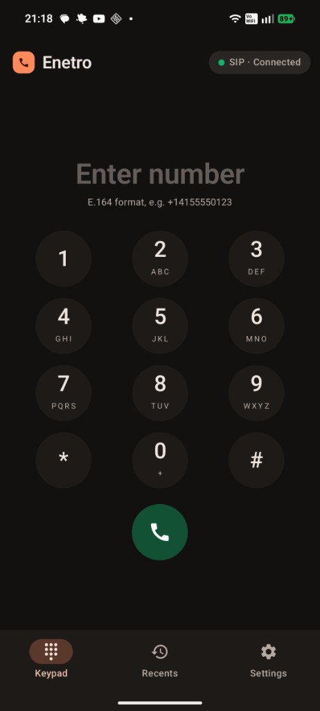
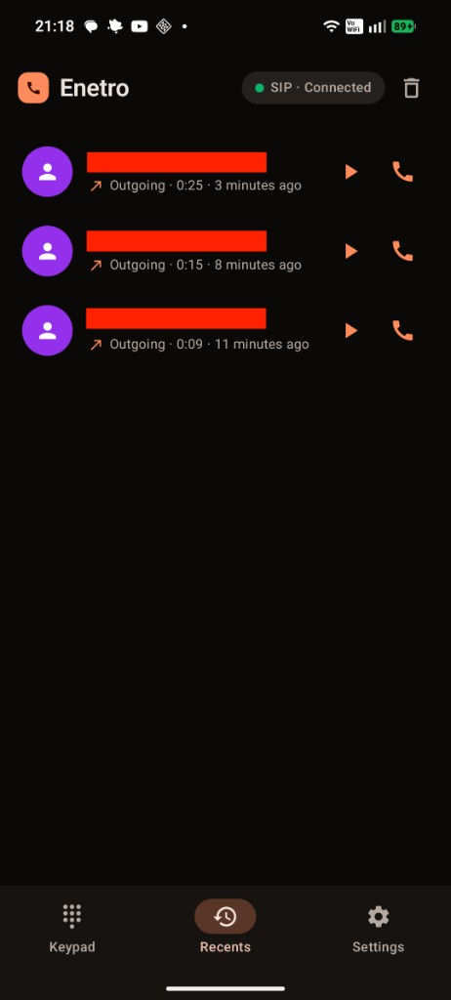
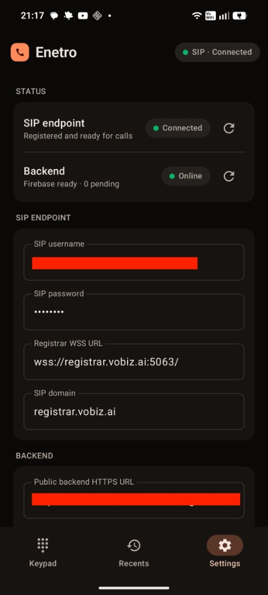
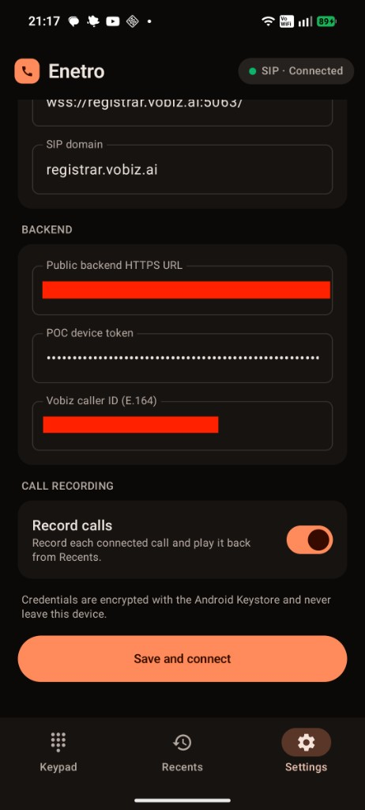

# Vobiz VoIP POC

Native Kotlin Android proof of concept for inbound and outbound PSTN calls through
Vobiz using SIP over secure WebSocket and WebRTC audio.

The repository contains:

- `app/` — Android 12+ Jetpack Compose application;
- `backend/` — local TypeScript Answer URL, call-state, and FCM service;
- `DOCS/VOBIZ_ANDROID_POC_DESIGN.md` — approved design;
- `DOCS/SETUP_GUIDE.md` — configuration and run instructions.

## Screenshots

| Keypad | Recents | Settings — status | Settings — backend |
| --- | --- | --- | --- |
|  |  |  |  |

## Local verification

```bash
./gradlew testDebugUnitTest assembleDebug
cd backend
npm install
npm run typecheck
npm audit --omit=dev
```

The debug APK is generated at `app/build/outputs/apk/debug/app-debug.apk`.

Do not commit Vobiz credentials, Firebase files, TURN credentials, `.env` files, or
signing keys.
