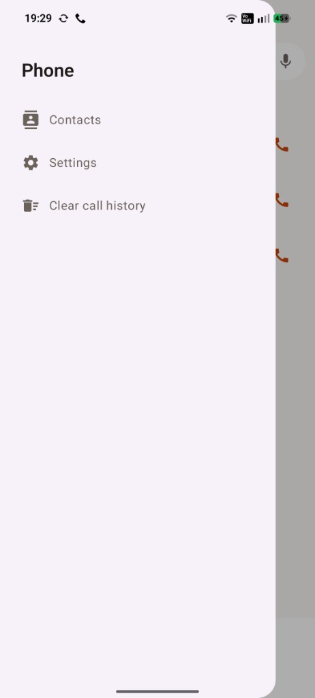
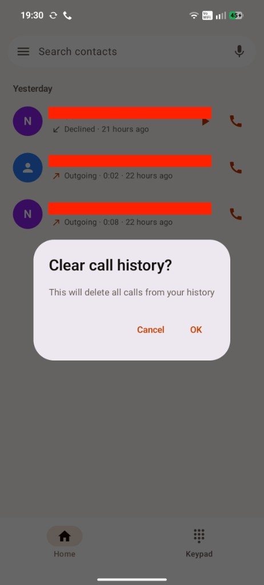

# Vobiz VoIP POC

Native Kotlin Android proof of concept for inbound and outbound PSTN calls through
Vobiz using SIP over secure WebSocket and WebRTC audio.

The repository contains:

- `app/` — Android 12+ Jetpack Compose application;
- `backend/` — local TypeScript Answer URL, call-state, and FCM service;
- `DOCS/CONFIGURATION_AND_INTEGRATION.md` — Settings values and app-to-app contracts (dial, call state, call log);
- `DOCS/SETUP_GUIDE.md` — install, tunnel, and test order;
- `DOCS/ANSWER_AND_HANGUP_WEBHOOKS.md` — Vobiz Answer and Hangup webhook request/response samples;
- `DOCS/VOBIZ_ANDROID_POC_DESIGN.md` — approved design.

## Screenshots

| Recents | Keypad | Side menu |
| --- | --- | --- |
|  |  |  |

| Settings — status | Settings — backend | Clear call history |
| --- | --- | --- |
|  |  |  |

## Dialer UI

The app mimics a native phone dialer:

- two bottom tabs — **Home** (recents) and **Keypad**;
- a **Search contacts** bar on Home; typing filters device contacts;
- recents grouped into **Today / Yesterday / Older**, with contact-name resolution;
- a side menu (hamburger) with **Contacts**, **Settings**, and **Clear call history**;
- outbound-number normalization: a leading `0` is replaced with the current country
  code, a bare national number gets the country code prepended, and already-international
  (`+…`) numbers are left unchanged. The country code is taken from the SIM, falling back
  to a **Default country** chosen in Settings when no SIM is present.

## App integration (intents, call-log provider, call-state monitoring)

Full field list, intent extras, provider columns, and examples:
[DOCS/CONFIGURATION_AND_INTEGRATION.md](DOCS/CONFIGURATION_AND_INTEGRATION.md).

The app is a SIP/WebRTC softphone, so its calls never touch Android's system
`CallLog`. Instead it keeps its **own** call history and exposes the integration
points below.

### Make a call via an intent

Other apps (or `adb`) can launch the dialer or place a call. Numbers are normalized
before dialing (leading `0` → country code, bare number → country code prepended,
`+…` untouched).

```kotlin
// 1) Open the Enetro dialer, optionally pre-filled from a tel: URI
startActivity(Intent(Intent.ACTION_DIAL, Uri.parse("tel:+919876543210")))

// 2) Ask Enetro VoIP to place the call directly (explicit action + EXTRA_NUMBER)
startActivity(
    Intent("com.enetro.vobizvoip.action.CALL").apply {
        setPackage("com.enetro.vobizvoip")
        putExtra("number", "09876543210") // normalized to +91… via SIM/default region
    },
)
```

```bash
# Pre-fill the dialer
adb shell am start -a android.intent.action.DIAL -d tel:+919876543210

# Place a call through the explicit app action
adb shell am start -a com.enetro.vobizvoip.action.CALL \
  -n com.enetro.vobizvoip/.MainActivity --es number "09876543210"
```

The manifest also handles `tel:` links via `ACTION_VIEW`/`ACTION_CALL`, so web/other
apps can hand off to it. (The app does not register as the OS default dialer; calls go
over SIP, not the cellular stack.)

### Query the call log (and recording path) from another app

The `CallLogProvider` exposes the VoIP call history — including the associated
recording when call recording is enabled — behind a normal-level custom permission.

The calling app declares the permission:

```xml
<uses-permission android:name="com.enetro.vobizvoip.permission.READ_CALL_LOG" />
```

Then queries the provider:

```kotlin
val calls = Uri.parse("content://com.enetro.vobizvoip.provider.calllog/calls")
contentResolver.query(calls, null, null, null, null)?.use { c ->
    val number = c.getColumnIndexOrThrow("number")
    val name = c.getColumnIndexOrThrow("display_name")
    val type = c.getColumnIndexOrThrow("type")            // 1=incoming, 2=outgoing, 3=missed
    val date = c.getColumnIndexOrThrow("date")            // epoch millis
    val duration = c.getColumnIndexOrThrow("duration")    // seconds
    val recordingPath = c.getColumnIndexOrThrow("recording_path") // content:// URI or null
    while (c.moveToNext()) {
        c.getString(recordingPath)?.let { path ->
            // Streamed from the backend by the provider; the auth token stays in Enetro VoIP.
            contentResolver.openInputStream(Uri.parse(path))?.use { audio -> /* play/save */ }
        }
    }
}
```

Columns: `_id`, `entry_id`, `number`, `display_name`, `direction`, `type`, `result`,
`date`, `duration`, `recording_available`, `recording_path`. A single entry is available
at `content://com.enetro.vobizvoip.provider.calllog/calls/{entry_id}`. `recording_path`
is `null` unless recording is enabled and a recording was matched to the call.

```bash
# The caller must hold com.enetro.vobizvoip.permission.READ_CALL_LOG
adb shell content query --uri content://com.enetro.vobizvoip.provider.calllog/calls
```

### Monitor call states

The app watches the device's **cellular** call state with the API 31+
`TelephonyCallback` (see `telephony/CallStateMonitor.kt`) and auto-mutes the VoIP
microphone while a native phone call is off-hook. To do the same in your own code
(requires `READ_PHONE_STATE`):

```kotlin
class MyTelephonyCallback : TelephonyCallback(), TelephonyCallback.CallStateListener {
    override fun onCallStateChanged(state: Int) {
        when (state) {
            TelephonyManager.CALL_STATE_IDLE -> { /* call ended or idle */ }
            TelephonyManager.CALL_STATE_RINGING -> { /* phone is ringing */ }
            TelephonyManager.CALL_STATE_OFFHOOK -> { /* active, or on hold */ }
        }
    }
}

val telephonyManager = getSystemService(TelephonyManager::class.java)
val callback = MyTelephonyCallback()
telephonyManager.registerTelephonyCallback(mainExecutor, callback) // API 31+
// …later:
telephonyManager.unregisterTelephonyCallback(callback)
```

## Local verification

```bash
./gradlew testDebugUnitTest assembleDebug
cd backend
npm install
npm run typecheck
npm audit --omit=dev
```

The debug APK is generated at `app/build/outputs/apk/debug/app-debug.apk`.

To produce a signed release APK:

```bash
./scripts/generate-keystore.sh         # creates keystore + updates keystore.properties
./scripts/build-signed-apk.sh          # builds dist/vobizvoip-<version>-release.apk
```

The signed APK is copied to `dist/vobizvoip-<version>-release.apk`. See
`keystore.properties.example` and the script `--help` for environment-variable
overrides. Back up the keystore and `keystore.properties`; losing them means
you cannot update an installed release build.

Do not commit Vobiz credentials, Firebase files, TURN credentials, `.env` files, or
signing keys.
